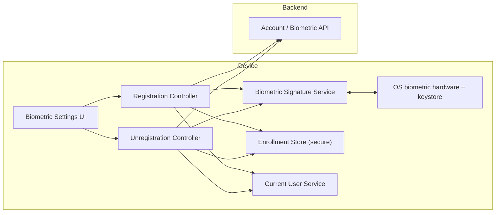
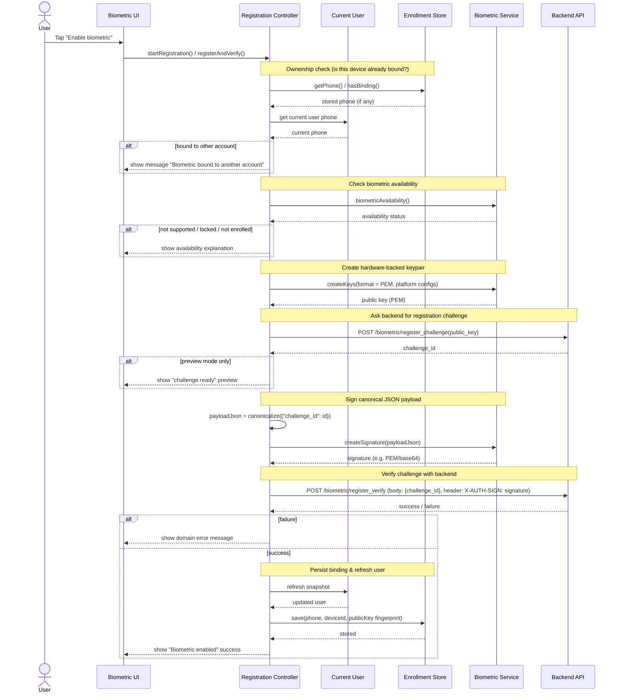
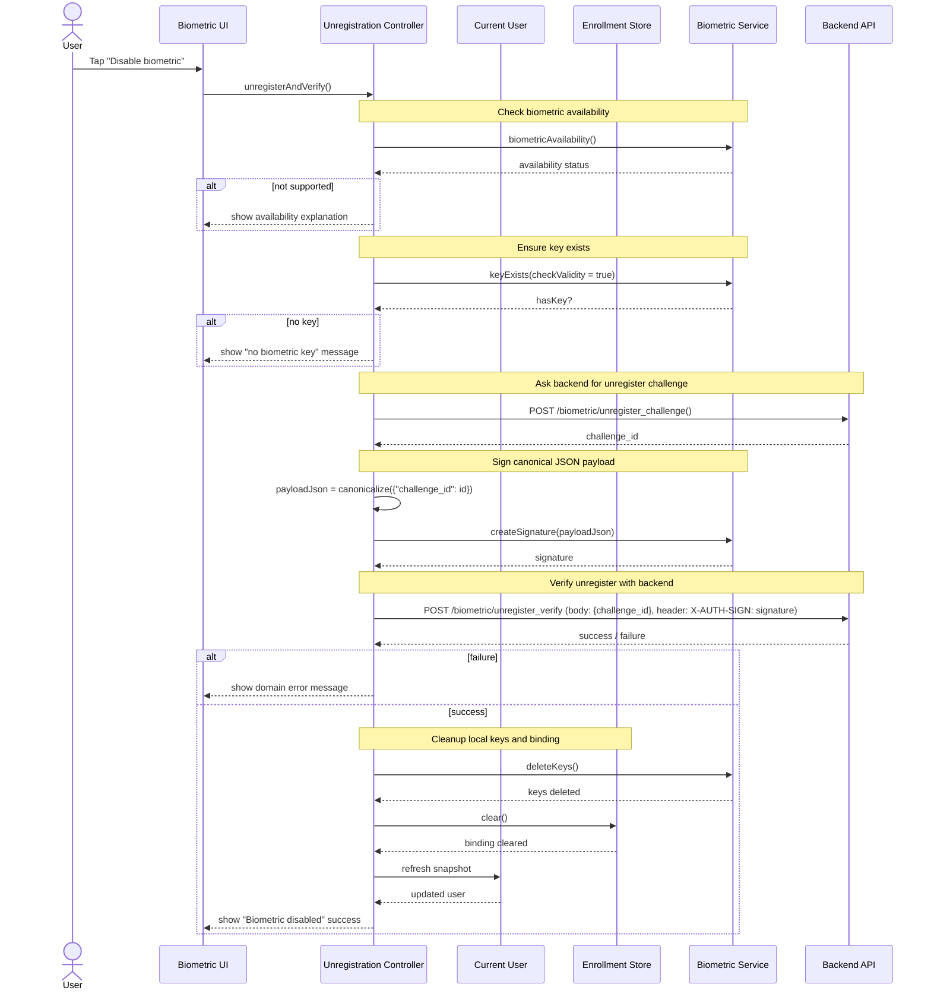

# Biometric Enrollment & Verification in PesantrenQu

## TL;DR

In PesantrenQu the product required biometric authentication (fingerprint / Face ID) as an optional,
secure shortcut for parents to access their accounts. A simple "remember me" toggle was not enough,
because the app is multi-tenant and runs on shared family devices. Instead, I designed an
end-to-end flow where the device creates a hardware-backed keypair, proves possession to the backend
via challenge-response on canonical JSON, and binds that keypair to a single account and device.
This lets the server verify every biometric action while still giving users a smooth experience and
clear error messages.

---

## Context

In this app users can optionally enable biometric authentication (fingerprint / Face ID) for faster
and more secure access. Because one parent can have accounts on multiple devices (and multiple
schools), the system must:

- Use the platform keystore (hardware-backed keys).
- Prove to the backend that **this device** signed a challenge for **this account**.
- Cleanly bind and unbind devices without confusing users.

---

## Problem & constraints

Simply toggling "use biometrics" in the UI is not enough. I needed something that worked for real
families sharing devices, not just a fake lock screen:

- The device must generate and keep a **hardware-backed keypair**, with the private key never
  leaving the OS keystore.
- The backend must verify that a challenge is signed using a **known public key** for that
  user/device.
- A single device's biometrics must **not** be silently reused across multiple accounts.
- Platform-specific issues (no hardware, not enrolled, lockout, permissions) must translate into
  clear messages, not raw error codes.

On top of that, PesantrenQu:

- Runs on a wide range of Android devices with different biometric hardware quality.
- Needs to support multiple accounts per device over time (parents switching accounts, children
  using the same phone, etc.).
- Cannot rely on "security by obscurity" in the client; the backend must be able to verify every
  biometric action.

I needed an end-to-end flow that is secure, verifiable, and user-friendly.

---

## Goals

- Use **hardware-backed keys** via the platform keystore (Android/iOS), with the private key never
  exposed to the app.
- Implement a **challenge-response** protocol the backend can verify using a stored public key.
- Safely **bind** a device's biometric keys to a single account, with protection against
  cross-account reuse.
- Provide **good UX** around availability issues, permission problems, and error states.

---

## Options considered

Before settling on the current design, I considered a few simpler approaches:

- **Local "remember me" toggle with stored tokens**  
  This would have been easy to implement, but keeping long-lived tokens on device and trusting the
  app alone to protect them did not meet our security expectations.
- **Using platform biometrics only as a UI lock**  
  Some apps just show a biometric gate over a local session. That pattern does not let the backend
  verify which device or key signed a request, which I needed for sensitive flows.
- **One-size-fits-all PIN without device binding**  
  A single PIN shared across devices would not prevent silent reuse or account confusion when
  multiple parents share phones.

All of these options either pushed too much trust onto the client or made it hard for the server to
reason about which device and keypair were involved. I decided to design a dedicated biometric
signature service and secure enrollment store, and build a canonical JSON challenge-response flow
around them.

---

## Chosen solution: biometric enrollment and verification

Once I committed to challenge-response with hardware-backed keys, I designed a small set of
device-side services and controllers that work together with dedicated backend endpoints. The core
idea is that the app never handles private keys directly and the server can always verify which key
and device signed a given payload.

### System architecture overview

This diagram shows the main components involved in biometric enrollment and verification. The app
uses a dedicated biometric service abstraction, a secure enrollment store, and domain use cases that
talk to backend biometric endpoints.



---

### Enrollment flow (enable biometric)

**Scenario:** The user taps "Enable biometric" in the security settings. The app must generate a
keypair, register it with the backend, prove possession by signing a challenge, and store a safe
local binding.



### How the enrollment flow works

#### 1. Ownership and binding checks

- Before touching biometrics, the registration controller checks whether this device is already
  bound:
  - Reads stored phone (if any) from the secure enrollment store.
  - Reads the currently logged-in user's phone from the current user service.
- If the stored phone and current phone refer to **different accounts**, the flow stops and shows a
  message like:
  - "Biometrik pada perangkat ini masih terhubung ke akun \*\*\*\*1234. Nonaktifkan biometrik dari
    akun tersebut sebelum mengaktifkannya untuk akun ini."
- This prevents a single device's biometrics from silently being reused across multiple accounts.

#### 2. Biometric availability and user messaging

- The controller calls the biometric service abstraction, which wraps the `biometric_signature`
  plugin, to ask for availability.
- The service normalizes platform-specific results into high-level statuses:
  - `supported`, `notEnrolled`, `noHardware`, `temporarilyUnavailable`, `lockedOut`,
    `noPermission`, `unknown`.
- A shared message helper then turns these statuses into localized, user-friendly explanations
  (for example, "Belum ada sidik jari terdaftar...").
- If biometrics cannot be used (no sensor, no enrollment, lockout, missing permission), the
  controller surfaces the right message and stops the flow.

#### 3. Keypair creation (hardware-backed)

- When biometrics are available, the controller asks the biometric service to create a new keypair:
  - The OS keystore stores the private key, protected by biometrics or device credentials.
  - The app only receives the public key string (PEM/base64) and optionally raw bytes.
- This public key is what the backend will use later to verify signatures.

#### 4. Challenge-response registration

- The controller calls a domain use case that hits `/biometric/register_challenge`, passing a
  base64-encoded version of the public key.
- The backend:
  - Stores the public key against the user.
  - Returns a `challenge_id` representing a one-time challenge.
- For "preview only" flows, this challenge ID is enough to show that biometrics can be set up
  successfully.

#### 5. Canonical JSON plus signing

- For full enrollment, the controller builds a tiny JSON object containing the `challenge_id`.
- Instead of signing an arbitrary map, it passes this through a JSON canonicalizer:
  - Keys are sorted.
  - Whitespace is normalized.
  - The resulting string is deterministic.
- This canonical JSON string is given to the biometric service, which:
  - Prompts the user with the system biometric dialog (fingerprint / Face ID).
  - Produces a signature using the hardware-backed private key.

#### 6. Backend verification and local binding

- The app sends the canonical payload and signature to `/biometric/register_verify`:
  - Body: the canonical JSON (`{"challenge_id": ...}`).
  - Header: `X-AUTH-SIGN` containing a normalized base64 signature.
- The backend reconstructs the same canonical JSON and verifies the signature using the stored
  public key.
- On success:
  - The controller refreshes the current user snapshot so the UI learns that biometrics are
    active.
  - The controller computes a fingerprint of the public key (for example SHA-256 over the PEM)
    and stores, in secure storage:
    - The user's phone.
    - The device ID (when available).
    - The public key fingerprint (not the key itself).
  - The user sees a clear success message.

If any step fails, errors are mapped to user-friendly messages and the controller attempts to clean
up local keys when appropriate.

---

### Unregistration flow (disable biometric)

**Scenario:** The user taps "Disable biometric". The app must prove possession of the key again,
notify the backend, and then safely delete keys and bindings.



### How the unregistration flow works

#### 1. Availability and key existence

- As with enrollment, the unregistration controller first checks biometric availability.
- It then calls `keyExists(checkValidity: true)` to ensure a valid keypair actually exists for this
  app on this device.
- If there is no key to remove, the user gets a specific message like:
  - "Kunci biometrik tidak ditemukan di perangkat ini."

#### 2. Unregister challenge plus signing

- The controller asks the backend for an **unregister challenge**:
  - A new `challenge_id` dedicated to turning off biometrics.
- It builds the same canonical JSON payload with this ID and asks the biometric service to sign it,
  prompting the user to confirm via fingerprint or Face ID.

#### 3. Backend verification and cleanup

- The app calls `/biometric/unregister_verify` with:
  - Body: canonical JSON with `challenge_id`.
  - Header: `X-AUTH-SIGN` carrying the normalized signature.
- Once the backend confirms the signature and removes its registration:
  - The controller asks the biometric service to delete the keys from the OS keystore.
  - The enrollment store is cleared (phone, device ID, public key fingerprint).
  - The current user snapshot is refreshed so the UI knows biometrics are turned off.
  - A success message is shown.

If a domain or network error occurs, the controller maps it to a clear message and logs details for
debugging.

---

## Core concepts in the flow

### Biometric availability

- High-level statuses (`supported`, `notEnrolled`, `noHardware`, `temporarilyUnavailable`,
  `lockedOut`, `noPermission`, `unknown`) abstract away platform-specific strings.
- A single helper maps statuses to localized, actionable messages that controllers and widgets
  reuse.

### Biometric signature service

- An abstraction over the `biometric_signature` plugin that:
  - Checks availability.
  - Creates hardware-backed keypairs.
  - Signs arbitrary payloads (like canonical JSON) with the private key.
  - Deletes keys when unbinding biometrics.

```dart
// Biometric service abstraction
// (lib/core/services/biometric/biometric_signature_service.dart)

abstract class IBiometricSignatureService {
  Future<BiometricAvailabilityInfo> biometricAvailability();

  Future<bool> keyExists({bool checkValidity = false});

  Future<BiometricKeyCreation> createKeys({
    BiometricKeyFormat format = BiometricKeyFormat.base64,
    bool androidUseDeviceCredentials = false,
    AndroidKeyAlgorithm androidAlgorithm = AndroidKeyAlgorithm.rsa,
    bool iosUseDeviceCredentials = false,
    IOSKeyAlgorithm iosAlgorithm = IOSKeyAlgorithm.rsa,
  });

  Future<BiometricSignatureData> createSignature({
    required String payload,
    BiometricKeyFormat format = BiometricKeyFormat.base64,
    bool androidAllowDeviceCredentials = false,
    String? androidCancelButtonText,
    bool iosShouldMigrate = false,
    String promptMessage = 'Authenticate',
  });

  Future<bool> deleteKeys();
}
```

### Enrollment store (secure binding)

- A small secure store (`FlutterSecureStorage`) that holds:
  - The phone tied to the biometric binding.
  - The device ID (if available).
  - A fingerprint of the public key (not the key itself).
- Used to:
  - Check whether this device is already bound to some account.
  - Log safe diagnostics (for example masked phone).

```dart
// Secure binding store
// (lib/core/storage/biometric_enrollment_store.dart)

abstract class IBiometricEnrollmentStore {
  Future<void> save({
    required String phone,
    String? deviceId,
    String? publicKeyFingerprint,
  });
  Future<String?> getPhone();
  Future<String?> getDeviceId();
  Future<String?> getPublicKeyFingerprint();
  Future<bool> hasBinding();
  Future<void> clear();
}
```

### Canonical JSON

- Ensures the exact string signed by the device is the same string reconstructed by the backend:
  - Keys sorted, whitespace normalized, deterministic encoding.
- Avoids subtle signature verification failures caused by different JSON serializers.

---

## Why this design is useful

- **Security first:** The design uses the OS keystore and challenge-response signatures instead of
  storing secrets or raw tokens in the app.
- **Backend-verifiable:** The server can prove that a specific device (public key) signed a specific
  challenge (canonical JSON), which is critical for sensitive operations like biometric login.
- **Safe multi-account behavior:** Local binding and ownership checks prevent one device's
  biometrics from silently being reused for multiple accounts.
- **Good UX under failure:** Users see clear messages about why biometrics cannot be used (no
  hardware, no enrollment, lockouts, permission issues) instead of generic "something went wrong"
  errors.

---

## Data flow summary

1. **Device and user state -> enrollment controller:**  
   Current user snapshot plus the secure enrollment store determine whether the device can be bound
   for this account.
2. **Enrollment controller -> biometric service -> backend:**  
   Enrollment uses keypair creation, register challenge, canonical JSON signing, and register
   verify.
3. **Enrollment controller -> enrollment store -> current user:**  
   On success, the binding is persisted securely and the user snapshot is refreshed.
4. **Unregistration controller -> biometric service -> backend:**  
   Unregistration repeats the challenge-response pattern to safely disable biometrics server-side.
5. **Unregistration controller -> biometric service -> enrollment store:**  
   Keys are deleted and the local binding is cleared, leaving the device in a clean state.

```dart
// Example enrollment controller entry point
// (lib/features/biometric/presentation/controllers/biometric_registration_controller.dart)

class BiometricRegistrationController extends GetxController {
  final IBiometricSignatureService _bio;
  final RegisterBiometricChallengeUseCase _registerChallenge;
  final RegisterBiometricVerifyUseCase _registerVerify;

  // ...

  Future<void> registerAndVerify() => _runRegistration(previewOnly: false);

  Future<void> _runRegistration({required bool previewOnly}) async {
    state.value = const BiometricRegistrationLoading();

    // 1) Ownership check (is this device already bound?)
    final bindingOk = await _ensureBindingOwnership();
    if (!bindingOk) return;

    // 2) Availability check
    final availability = await _bio.biometricAvailability();
    if (!availability.isSupported) {
      _emitNoSupport(availability.status);
      return;
    }

    // 3) Create keypair and request challenge
    final key = await _bio.createKeys(format: BiometricKeyFormat.pem);
    final challengeResult = await _registerChallenge(publicKey: key.value);

    // 4) Canonical JSON + signature + verify (see full code for details)
    // ...
  }
}

// Example unregistration controller entry point
// (lib/features/biometric/presentation/controllers/biometric_unregistration_controller.dart)

class BiometricUnregistrationController extends GetxController {
  final IBiometricSignatureService _biometricService;
  final UnregisterBiometricChallengeUseCase _unregisterChallenge;
  final UnregisterBiometricVerifyUseCase _unregisterVerify;

  // ...

  Future<void> unregisterAndVerify() async {
    state.value = const BiometricUnregistrationLoading();

    final availability = await _biometricService.biometricAvailability();
    if (!availability.isSupported) {
      // show no-support message
      return;
    }

    final hasKey = await _biometricService.keyExists(checkValidity: true);
    if (!hasKey) {
      // show "no biometric key" message
      return;
    }

    final challengeResult = await _unregisterChallenge();
    // canonical JSON + signature + verify + cleanup happen next
  }
}
```

---

## Impact

This biometric design changed how secure login and account binding work in PesantrenQu:

- Biometric login became a first-class, optional shortcut that the backend can still verify, instead
  of just a local UI lock.
- Devices are safely bound to a single account at a time, which avoids confusing situations where a
  shared phone suddenly opens the wrong parent's data.
- When biometric hardware is missing, locked, or misconfigured, users see clear explanations tied
  to the real cause, not generic "failed" errors.
- From a debugging and maintenance perspective, the separation between the biometric service,
  enrollment store, and domain use cases makes it easier to reason about failures and extend the
  flow later.

## What I learned

Working on this biometric flow taught me a few things:

- Treating biometrics as **cryptographic keys plus challenges**, not just a prettier password
  prompt, leads to designs the backend can trust and reason about.
- Having a dedicated biometric signature service abstraction instead of calling plugins directly
  keeps the rest of the app testable and platform-agnostic.
- Modelling a **secure local binding** (phone, device ID, key fingerprint) is crucial when devices
  and accounts mix over time, especially in family scenarios.
- Good UX around failure cases (no hardware, lockouts, missing keys) matters as much as the happy
  path, because that is where users decide whether to keep biometrics on or turn them off.
