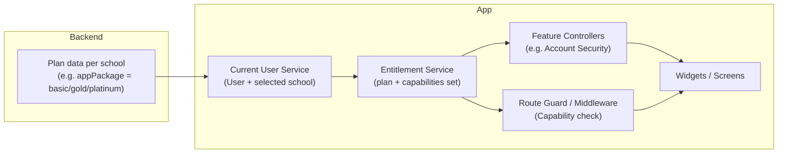
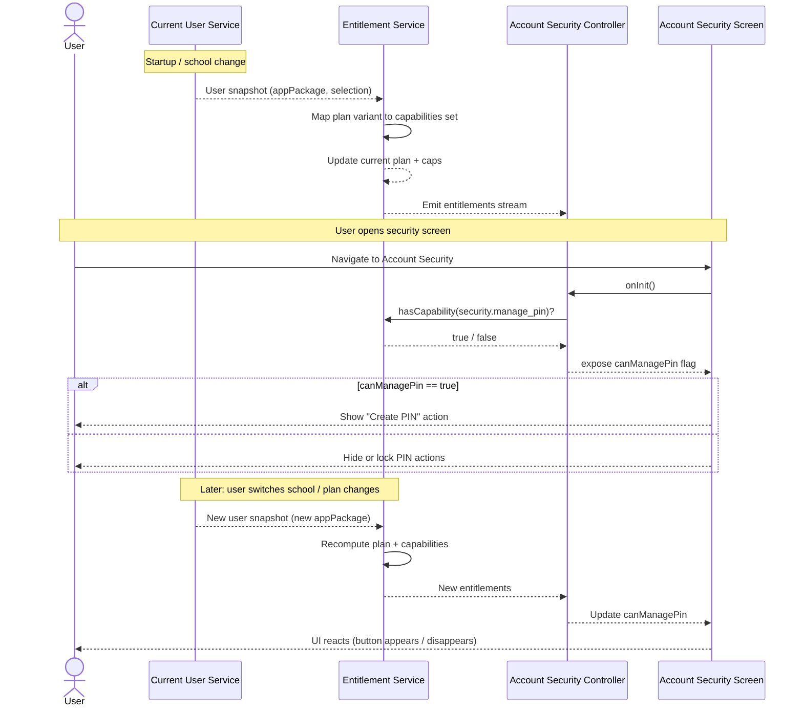
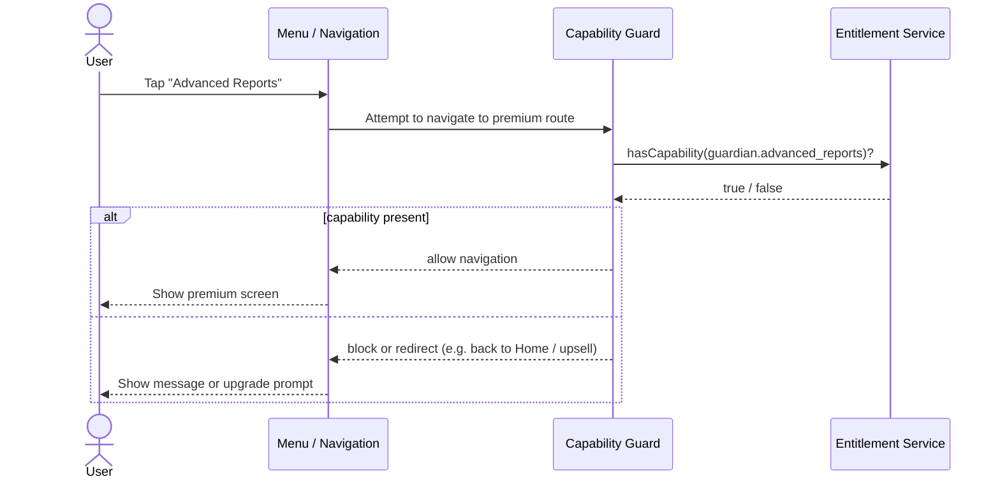

# Capability-Based Entitlement System

## TL;DR

In PesantrenQu I needed to support multiple plans (Basic/Gold/Platinum) per school, with parents
able to switch schools inside the app. A naive approach with `if (plan == "gold")` checks scattered
across controllers and widgets would have been fragile and hard to change. I designed a
capability-based entitlement service instead, where plans map to capabilities like
`guardian.financial_overview` or `security.manage_pin`, and controllers, UI, and route guards ask
for capabilities rather than plan names. This made it much easier to move features between plans,
add new plans, and keep navigation safe.

---

## Context

This case study comes from the PesantrenQu parent–school super app. Each school can subscribe to one
of several plans: **Basic**, **Gold**, or **Platinum**.

A single parent can be connected to multiple schools and switch between them inside the app. Some
features (like advanced reports or financial dashboards) should only be available on higher‑tier
plans, depending on the active school’s subscription.

---

## My role

I designed and implemented the capability-based entitlement layer in the Flutter client. That
included:

- Defining plan variants and capability value objects.
- Building the plan-to-capabilities mapping and the `IFeatureEntitlementService`.
- Integrating entitlements into controllers, widgets, and navigation (route guards).
- Coordinating with backend and product on where plan data lives and how new plans or promotions
  would be represented.

---

## Problem & constraints

The naive implementation would be to sprinkle checks like `if (plan == "gold")` across controllers
and widgets. I had seen that pattern before, and it always turns into the same problems:

- It is hard to maintain as the app grows, because plan logic is duplicated everywhere.
- It is easy to get wrong (especially with deep links and direct route calls).
- It is painful to change when business wants to move features between plans, run promotions, or
  introduce new variants.

On top of that, the app is:

- **Multi-tenant:** the active plan is tied to the currently selected school.
- **Heavily routed:** premium features must be protected even for deep links and direct route calls.
- **Evolving:** product expects to change which plan gets which feature over time, without a big
  refactor every time.

I needed a way to ask **“Can this user do X right now?”** that works consistently across:

- Routing and deep links.
- Controllers and UI.
- Domain logic and use cases.

---

## Goals

- Have a **single source of truth** for “which features are available on which plan”.
- Let feature code depend on **capabilities** (“manage PIN”, “view advanced reports”), not plan
  names (“Gold”, “Platinum”).
- Make plan changes safe and easy: update one mapping instead of editing many screens.
- Enforce entitlements in layers (UI visibility, route guards, domain checks) so the experience is
  both user‑friendly and robust against navigation tricks.

---

## Options considered

Before landing on capability-based entitlements, I considered a few simpler approaches:

- **Raw plan checks in controllers and widgets**  
  Easy to start, but the checks would be duplicated everywhere and very hard to update when plans
  change.
- **Per-feature booleans from the backend**  
  This would push some logic to the server, but still leaks low-level flags into many parts of the
  client. It also becomes messy when features are grouped differently per screen.
- **Helpers like `isGoldOrAbove()` sprinkled around**  
  Slightly better than plain string checks, but still ties feature logic to specific plan names,
  and does not scale when new plans or cross-cutting capabilities are added.

All of these options failed the “can we move this feature to a different plan without touching
multiple controllers and screens?” test, so I decided to model explicit capabilities and keep a
single mapping from plans to capabilities.

---

## Chosen solution: capability-based entitlements

Once I settled on capabilities, I shaped the system as a small entitlement layer that translates
backend plan data into a plan variant and a set of capabilities. Controllers, UI, and navigation
query that layer instead of hard-coding plan names.

### Architecture overview

At a high level I designed the entitlement layer as a thin service sitting between the current user
snapshot and the rest of the app. It listens to plan data from the backend, resolves it into a plan
variant and a set of capabilities, and exposes that to controllers, widgets, and route guards.

This diagram shows how plan information flows from the backend through the entitlement service to
controllers and UI components. The system uses capability-based access control to decouple feature
availability from specific plan names.



---

### Runtime flow: capability check

**Scenario:** The user navigates to the Account Security screen. The system checks whether the user
has the `security.manage_pin` capability and updates the UI accordingly. The UI automatically reacts
when the user switches school or when plan changes occur.



#### How this flow works

#### 1. Backend → current user → entitlements

- The backend associates each school with a plan (e.g. via a plan code or package string).
- The app fetches the current user snapshot, which contains:
  - User information.
  - The currently selected school.
  - That school’s plan indicator (e.g. `basic`, `gold`, `platinum`).
- Whenever the snapshot changes (login, logout, switch school), the entitlement service:
  - Reads the plan indicator.
  - Maps it to a plan variant.
  - Looks up the corresponding capability set from a central mapping.
  - Stores this as the **current plan + capabilities** and emits an update.

#### 2. Controllers and UI using capabilities (not plans)

- Feature controllers never ask “is this Gold or Platinum?” directly.
- Instead they ask the entitlement service: **“Do we have capability X?”**
  - Example: the account security controller asks for `security.manage_pin` to decide whether to
    show the “Create PIN” action.
- On initialization:
  - Controllers call `hasCapability(...)` once to seed booleans like `canManagePin`,
    `canSeeFinancialOverview`, `canUseMarketplace`.
  - When features must react to plan changes at runtime (for example when the user switches
    school),
    controllers subscribe to the entitlements stream and update those booleans whenever a new
    plan / capability set arrives.
- Widgets then bind to those booleans and:
  - Show or hide actions.
  - Show a “locked” state with an upsell message.
  - Or route the user to an upgrade flow.

---

### Route protection flow

**Scenario:** The user attempts to navigate to a premium feature (for example via menu, deep link,
or direct navigation). I still want the same capability rules to apply, so a route guard checks
capabilities before allowing access, preventing
unauthorized navigation even via direct URLs.



#### Routing and deep-link protection

- Some screens are premium and should never be accessible without the right plan, even if:
  - A developer calls the route directly by mistake.
  - A deep link or push notification points to the premium route.
- For these routes, the navigation layer can attach a **capability guard**:
  - Before navigation completes, the guard calls `hasCapability(...)`.
  - If the capability is present, navigation proceeds.
  - If not, navigation is blocked or redirected (e.g. back to home, or to an upgrade screen).
- This acts as a safety net on top of the UI gating:
  - UI **tries** not to show buttons and links the user shouldn’t see.
  - Route guards **ensure** the user cannot reach protected screens without entitlements.

---

### What this system does

- Models three commercial plan variants (**Basic**, **Gold**, **Platinum**) and maps each plan to a
  set of **capabilities** (features the user is allowed to use, like “manage PIN”, “guardian
  financial overview”, “advanced reports”).
- Provides a single **entitlement service** that answers:
  - “What plan is active for the currently selected school?”
  - “Does the current user have capability X right now?”
  - “Notify me when plan / capabilities change.”
- Uses those answers in:
  - Controllers & UI to show / hide or lock specific actions and menu items.
  - Route guards to prevent navigation to premium screens without the right capabilities, even via
    deep links.

---

### Core concepts

### Plan variant

I modelled the plan as a simple label like `basic`, `gold`, or `platinum` derived from the
backend‑provided `appPackage` on the current user snapshot. Conceptually this reflects the active
school’s subscription plan.

```dart
// Plan variants (lib/core/services/entitlements/plan_variant.dart)
enum PlanVariant { basic, gold, platinum }
```

### Capability

A capability is a stable, namespaced “ability” such as:

- `security.manage_pin`
- `guardian.financial_overview`
- `guardian.advanced_reports`

```dart
// Capability value object and per-module capabilities
// (lib/core/services/entitlements/capability.dart and capabilities/*.dart)

class Capability {
  final String id;
  final String? group;

  const Capability(this.id, {this.group});
}

class SecurityCapabilities {
  const SecurityCapabilities._();

  static const Capability managePin = Capability(
    'security.manage_pin',
    group: 'security',
  );
}
```

### Plan → capabilities mapping

I keep a central map that describes which capabilities each plan includes, for example:

- **Basic** → `{donation.basic}`
- **Gold** → `{donation.basic, guardian.financial_overview, security.manage_pin}`
- **Platinum** → everything in Gold + `guardian.advanced_reports`

```dart
// Central mapping (lib/core/services/entitlements/plan_capability_mapping.dart)

final Map<PlanVariant, Set<Capability>> kPlanCapabilities = {
  PlanVariant.basic: {
    DonationCapabilities.basicDonation,
  },
  PlanVariant.gold: {
    DonationCapabilities.basicDonation,
    GuardianCapabilities.financialOverview,
    MarketplaceCapabilities.core,
    SecurityCapabilities.managePin,
  },
  PlanVariant.platinum: {
    DonationCapabilities.basicDonation,
    GuardianCapabilities.financialOverview,
    MarketplaceCapabilities.core,
    GuardianCapabilities.advancedReports,
    SecurityCapabilities.managePin,
  },
};

Set<Capability> capabilitiesForPlan(PlanVariant plan) {
  return kPlanCapabilities[plan] ?? <Capability>{};
}
```

This mapping is the **only** place that encodes which plan gets which features. Feature code never
hard‑codes “Gold” or “Platinum”; it only asks for capabilities.

### Entitlement service

The entitlement service ties everything together. It:

- Listens to changes in the current user snapshot (including selected school and its plan).
- Converts backend / plan data into:
  - The effective plan variant.
  - The full set of capabilities for that plan.
- Exposes:
  - A quick `hasCapability(...)` check.
  - A stream of updates so the UI can react to plan / school changes.

```dart
// Interface and implementation (lib/core/services/entitlements/feature_entitlement_service.dart,
// lib/core/services/entitlements/feature_entitlement_service_impl.dart)

class FeatureEntitlements {
  final PlanVariant plan;
  final Set<Capability> capabilities;

  const FeatureEntitlements({required this.plan, required this.capabilities});
}

abstract class IFeatureEntitlementService {
  PlanVariant get currentPlan;

  bool hasCapability(Capability capability);

  Stream<FeatureEntitlements> watch();
}

class FeatureEntitlementServiceImpl implements IFeatureEntitlementService {
  final ICurrentUserService _currentUserService;
  FeatureEntitlements _current = const FeatureEntitlements(
    plan: PlanVariant.basic,
    capabilities: <Capability>{},
  );

  // ...

  @override
  bool hasCapability(Capability capability) {
    return _current.capabilities.contains(capability);
  }

  PlanVariant _resolvePlanForSnapshot(UserSnapshot? snapshot) {
    final userPackageRaw = snapshot?.user.appPackage.trim().toLowerCase() ?? '';
    if (userPackageRaw.isNotEmpty) {
      final mapped = _mapPackageStringToPlan(userPackageRaw);
      if (mapped != null) {
        return mapped;
      }
    }
    return PlanVariant.basic;
  }
}
```

---

### Why this design is useful

- **Capabilities over plans:** Feature code doesn’t care about “Gold vs Platinum”, it cares about
  specific abilities like “manage PIN” or “view advanced reports”. When business changes which plan
  includes which feature, I only need to update one mapping instead of touching many screens.
- **Single source of truth:** The entitlement service is the only place that knows the current plan
  and capabilities. Everything else (controllers, widgets, route guards) goes through it.
- **Multi‑tenant aware:** Since the plan is tied to the selected school, when the user switches
  school, the entitlement service recomputes entitlements and the UI can respond automatically.
- **Layered enforcement:**
  - Menus and screens use capabilities to control visibility and upsell.
  - Navigation guards use capabilities to prevent unauthorized access.
  - The backend is still expected to enforce plan rules server‑side, but the client gives
    immediate, clear feedback to the user.

---

### Data flow summary

1. **Backend → User Service → Entitlement Service:**  
   Plan data flows from backend through the user snapshot to the entitlement service, which maps it
   to capabilities.
2. **Entitlement Service → Controllers:**  
   Controllers query capabilities (not plans) to make feature decisions.
3. **Controllers → UI:**  
   UI binds to capability-based flags and shows / hides features accordingly.
4. **Entitlement Service → Route Guards:**  
   Navigation is protected by capability checks at the routing layer.
5. **Reactive updates:**  
   When the plan changes (school switch, upgrade / downgrade), the stream propagates updates
   throughout the app.

```dart
// Example controller usage (lib/features/profile/presentation/getx/security/account_security_controller.dart)

class AccountSecurityController extends GetxController {
  final IFeatureEntitlementService _entitlementService;

  final RxBool canManagePin = false.obs;
  StreamSubscription<FeatureEntitlements>? _entitlementSubscription;

  // ...

  void _bootstrapEntitlements() {
    // Seed from current entitlements
    canManagePin.value =
        _entitlementService.hasCapability(SecurityCapabilities.managePin);

    // React to future plan / school changes
    _entitlementSubscription = _entitlementService.watch().listen((entitlements) {
      final allowed =
      entitlements.capabilities.contains(SecurityCapabilities.managePin);
      if (canManagePin.value != allowed) {
        canManagePin.value = allowed;
      }
    });
  }
}
```

---

## Impact

This design changed how plan-based features behave in the app:

- It became much easier to move features between plans, or introduce new plan variants, by changing
  a single plan-to-capabilities mapping.
- Premium routes are protected even when someone calls them directly or via deep links, which
  reduces accidental access and makes the app more predictable.
- Controllers and widgets no longer have to know about plan names. They simply ask for
  capabilities, which keeps presentation logic cleaner and more testable.
- Because the entitlement service reacts to school switches, the UI updates automatically when
  parents switch between schools with different plans.

## What I learned

Working on this entitlement layer taught me a few things:

- Modelling **capabilities instead of plan names** gives a much better abstraction for both
  business and code, especially in multi-tenant apps.
- Keeping a **single source of truth** (the entitlement service) for plan and capabilities makes it
  easier to evolve pricing and feature sets without chasing edge cases across the UI.
- Capability checks are most effective when enforced in **multiple layers**: UI visibility,
  navigation guards, and backend validation.
- Investing time in this design early paid off later when we added new features and adjusted plans
  without having to rewrite large parts of the app.
