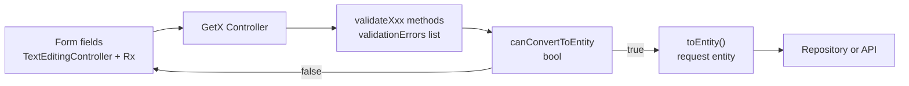
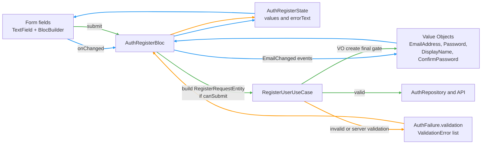

# Designing Validation Architecture with Value Objects in Orymu

## 1. TL;DR

In my earlier Flutter projects I already used Clean Architecture, but all validation logic lived
inside GetX controllers. As the forms got bigger, those controllers turned into long, stateful
classes that mixed UI state, validation rules, and mapping to request entities. It worked, but it
was fragile and hard to change.

When I started Orymu I decided to clean this up. I moved the validation rules into domain level
value objects, introduced a shared `ValueFailure` model, and used Bloc for presentation. Blocs now
use value objects for real time feedback, and use cases re validate everything as a final gate
before touching repositories. This keeps the rules in one place, gives better UX, and makes the sign
up flow much easier to reason about and test.

---

## 2. Context

Before Orymu, most of my production work was built with:

- Flutter as the main stack.
- GetX for routing and state management.
- Clean Architecture in the sense of separate presentation, domain, and data layers.

The apps were not small. They had complex flows like financial dashboards, tuition payments,
savings, and multi step onboarding. Because of that, I was already careful about layer boundaries
and repositories. However, my validation approach never evolved as much as the rest of the
architecture. I usually kept all form validation logic inside GetX controllers.

When I started Orymu, which is an AI powered reading and flashcard app, I wanted to use the project
to refine some parts of my architecture, not just copy the last setup. One of the biggest pains I
wanted to fix was how I handled validation in big forms like sign up.

I also decided to switch to Bloc for presentation. Bloc gave me a clearer pattern around events,
states, and side effects, which helped me separate UI concerns from validation and domain logic.

---

## 3. My Role

I designed and implemented the validation architecture for Orymu. That included:

- Defining value objects for core inputs like email, password, username, and display name.
- Designing the `ValueFailure` model and the mapping to user facing error messages.
- Wiring those value objects into Blocs for real time field validation.
- Adding a final validation gate inside use cases before they call repositories.
- Designing and implementing the sign up flow to use this pattern end to end.

The goal was not just to make one screen cleaner, but to build a pattern I could reuse for other
auth flows, onboarding, and future forms.

---

## 4. Problem and Constraints

### 4.1 How validation used to look

In previous projects I kept everything inside the controller. For example, a complex registration or
data entry controller would:

- Own many `TextEditingController` and `Rx` fields.
- Contain methods like `validateEmail`, `validatePhoneNumber`, `validateIncome`, and
  `validateRequiredField`.
- Build a list of `validationErrors` by calling all these methods.
- Expose computed getters like `isPersonalDataValid` and `canConvertToEntity`.
- Build the final request entity manually in a `toEntity()` method.

The example below is simplified, but the pattern is similar to what I used:

```dart
class CreateSomethingController extends GetxController {
  String email = '';
  String phone = '';

  String? validateEmail(String? email) {
    /* regex and messages */
  }

  String? validatePhone(String? phone) {
    /* length, prefix rules */
  }

  List<String> get validationErrors {
    final errors = <String>[];
    final emailError = validateEmail(email);
    if (emailError != null) errors.add(emailError);
    final phoneError = validatePhone(phone);
    if (phoneError != null) errors.add(phoneError);
    return errors;
  }

  bool get canConvertToEntity => validationErrors.isEmpty;

  RequestEntity toEntity() {
    /* read from controllers and build request */
  }
}
```

On real screens this became much bigger, with many more fields and rules. The
`CreateMustahikIndividualController` from one of my previous projects is a good example. It
contains:

- Dozens of fields and options.
- A long `toEntity()` method that converts internal state to a request.
- A set of `validateXxx` functions plus a `validationErrors` list that stitches them together.

It works, but everything lives in one class.

### 4.2 Why this became a problem

The pattern above created a few concrete problems for me:

- The controller kept growing. It was responsible for UI state, validation rules, formatting, and
  mapping to entities. Adding a new field or changing a rule always meant touching this large, mixed
  class.
- Validation was tightly coupled to widgets. The rules directly read from `TextEditingController`
  and `Rx` state. There was no reusable type like `EmailAddress` or `PhoneNumber` that I could share
  across flows.
- There was no real final gate in the domain. The controller tried to be the last line of defense
  with `canConvertToEntity`, but nothing enforced that every caller had to respect it before calling
  `toEntity()`.
- Testing validation properly required instantiating the whole controller, wiring controllers and Rx
  values, then calling validation methods. I could not test the business rules as small focused
  units.

When I started thinking about Orymu sign up and other auth flows, I realized I needed a better place
for the rules. I wanted validation to be part of the domain, not just a side effect of the UI
controller.

### 4.3 Constraints and goals

I put a few constraints on the new approach:

- Keep Clean Architecture boundaries intact. Validation rules should live in the domain layer, not
  in widget code.
- Give users good UX. I still wanted real time inline errors as they type.
- Stay defensive. The system should not rely on the UI alone. Use cases should never accept
  obviously invalid inputs.
- Keep things testable. I wanted to be able to write small, deterministic tests for the value
  objects without involving widgets or controllers.

---

## 5. Options Considered

When I redesigned validation for Orymu I thought through a few directions.

### Option 1: Keep validation in Bloc or controller, but organize it better

I could have kept all the rules inside the Bloc or a controller and just tried to structure it more
nicely. For example, I could group validation methods into a helper class or split them across
mixins.

This would have kept all logic in the presentation layer. It might make the Bloc a bit cleaner than
my old GetX controllers, but the rules would still not live in the domain, and use cases would still
have to trust the UI.

### Option 2: Introduce a validation service per form

Another idea was to create a per form validation service, for example `SignUpValidator`, that the
Bloc and use case could both call.

This looked better than having everything in the Bloc, but it still treated validation as a separate
service rather than part of the domain model. I would still need to invent error types and decide
how to pass user friendly messages around.

### Option 3: Move rules into domain value objects

The option that felt most aligned with Clean Architecture was to introduce value objects:

- Each field that has business rules gets its own value object, for example `EmailAddress`,
  `Password`, `Username`, and `DisplayName`.
- Creation happens through a factory or static method like `EmailAddress.create(input)`.
- The method returns `Either<ValueFailure, VO>`, where `ValueFailure` is a small union type that
  describes why the value is invalid.

This approach gives me:

- A single source of truth for each field rule.
- A simple, reusable error model with a `userMessage` mapper.
- A way for both Bloc and use case to rely on the same rules without duplication.

I decided to go with option 3 and build the Orymu sign up flow on top of value objects. It fits the
way I want to structure the domain: the rules live next to the concepts they protect, the
presentation layer just consumes them, and use cases still act as a final gate before repositories.
Value objects are also a common pattern in Domain Driven Design and industry practice, so I was not
inventing something ad hoc just for this app.

For a deeper explanation of value objects in general, I like Vladimir Khorikov's article
[Value Objects explained](https://enterprisecraftsmanship.com/posts/value-objects-explained/).

---

## 6. Chosen Solution

### 6.1 Value objects and failures

I started by defining value objects in the auth domain:

- `EmailAddress` with an `EmailAddress.create(String input)` factory.
- `Password` with a `Password.create(String input)` that enforces:
  - Minimum length.
  - At least one lowercase, one uppercase, and one digit.
- `ConfirmPassword` that compares the original and confirmation values.
- `Username` and `DisplayName` with their own length and format rules.

Each `create` method returns `Either<ValueFailure, VO>`. `ValueFailure` is a Freezed union that
encodes concrete reasons like `invalidEmail`, `shortPassword`, `missingUppercase`,
`passwordsDoNotMatch`, and `empty`.

I added a `userMessage` extension on `ValueFailure` so each failure maps to a human readable error
message. This keeps validation messages in one place and avoids hard coded strings spread across
widgets.

A simplified example of the `EmailAddress` value object in Orymu looks like this:

```dart
class EmailAddress {
  final String value;
  const EmailAddress._(this.value);

  static Either<ValueFailure, EmailAddress> create(String input) {
    final trimmed = input.trim();
    final regex = RegExp(r'^[^\\s@]+@[^\\s@]+\\.[^\\s@]+');
    if (regex.hasMatch(trimmed)) {
      return right(EmailAddress._(trimmed));
    } else {
      return left(ValueFailure.invalidEmail(input));
    }
  }
}
```

And the `Username` value object looks like this:

```dart
class Username {
  final String value;
  const Username._(this.value);

  static Either<ValueFailure, Username> create(String input) {
    final trimmed = input.trim();
    if (trimmed.isEmpty) {
      return left(ValueFailure.empty(input));
    }
    if (trimmed.length < 3) {
      return left(ValueFailure.shortUsername(input));
    }
    if (trimmed.length > 20) {
      return left(ValueFailure.longUsername(input));
    }
    final validFormat = RegExp(r'^[a-zA-Z0-9_]+$');
    if (!validFormat.hasMatch(trimmed)) {
      return left(ValueFailure.invalidUsernameFormat(input));
    }
    return right(Username._(trimmed));
  }
}
```

The rules live inside the value object, and callers only see a success value or a `ValueFailure`.

### 6.2 Two layers of validation

The sign up flow uses these value objects in two places.

1. **Field level in the Bloc**  
   The `AuthRegisterBloc` calls value object factories on every `EmailChanged`, `PasswordChanged`,
   `ConfirmPasswordChanged`, and `DisplayNameChanged` event. It stores the result as simple strings
   in the state:

   - If the value object returns `left(failure)` the Bloc stores `failure.userMessage` as
     `emailError` or `passwordError`.
   - If it returns `right(vo)` the error field is set to `null`.

   In code this looks like:

   ```dart
   void _onEmailChanged(EmailChanged event, Emitter<AuthRegisterState> emit) {
     final emailResult = EmailAddress.create(event.email);
     emit(state.copyWith(
       email: event.email,
       emailError: emailResult.fold(
         (failure) => failure.userMessage,
        (_) => null,
      ),
    ));
   }
   ```


The UI binds `errorText` of each field to these state properties and rebuilds via `BlocBuilder`.
This gives users immediate, field specific feedback without duplicating rules in the widget.

2. **Submit level in the use case**  
   The `RegisterUserUseCase` treats the same value objects as a final gate before the repository:

   - It calls `EmailAddress.create(request.email)`, `Password.create(request.password)`, and
     `DisplayName.create(request.displayName)`.
   - It collects any failures into a list of `ValidationError` objects with `field`, `message`, and
     `code`.
   - If there are any errors, it returns `AuthFailure.validation(errors)` instead of calling the
     repository.
   - If validation passes, it calls `_repository.register(request)` and continues the flow.

   A simplified version of the use case gate is:

   ```dart
   Future<Either<AuthFailure, UserEntity>> call(
     RegisterRequestEntity request,
   ) async {
     final email = EmailAddress.create(request.email);
     final password = Password.create(request.password);
     final displayName = DisplayName.create(request.displayName);

     final errors = <ValidationError>[];

     email.fold(
       (f) => errors.add(ValidationError(
         field: 'email',
         message: f.userMessage,
         code: 'invalid_email',
       )),
       (_) {},
     );

     password.fold(
       (f) => errors.add(ValidationError(
         field: 'password',
         message: f.userMessage,
         code: 'weak_password',
       )),
       (_) {},
     );

     displayName.fold(
       (f) => errors.add(ValidationError(
         field: 'display_name',
         message: f.userMessage,
         code: 'invalid_display_name',
       )),
       (_) {},
     );

     if (errors.isNotEmpty) {
       return left(AuthFailure.validation(errors));
     }

     return _repository.register(request);
   }
   ```

This pattern guarantees that repositories only see inputs that passed the domain rules, even if the
presentation layer has a bug.

### 6.3 Error propagation back to the UI

When the use case returns `AuthFailure.validation`, the Bloc knows how to map each `ValidationError`
back into field errors:

- It iterates over the `validationErrors` list.
- It switches on `error.field` (for example `email`, `password`, `display_name`, or
  `confirm_password`).
- It sets the corresponding `emailError`, `passwordError`, `displayNameError`, or
  `confirmPasswordError` in the state.

This way server side or final gate validation errors still surface on the correct fields in the
form.

A simplified version of that mapping is:

```dart
void _handleAuthFailure(
  AuthFailure failure,
  Emitter<AuthRegisterState> emit,
) {
  failure.when(
    validation: (validationErrors) {
      String? emailError;
      String? passwordError;
      String? displayNameError;
      String? confirmPasswordError;

      for (final error in validationErrors) {
        switch (error.field?.toLowerCase()) {
          case 'email':
            emailError = error.message;
            break;
          case 'password':
            passwordError = error.message;
            break;
          case 'display_name':
            displayNameError = error.message;
            break;
          case 'confirm_password':
            confirmPasswordError = error.message;
            break;
        }
      }

      emit(state.copyWith(
        status: AuthFormStatus.failure,
        emailError: emailError,
        passwordError: passwordError,
        displayNameError: displayNameError,
        confirmPasswordError: confirmPasswordError,
        message: null,
      ));
    },
    // other failures (network, server, etc.) map to generic messages
    network: () => emit(state.copyWith(
      status: AuthFormStatus.failure,
      message: 'Please check your internet connection',
    )),
    emailTaken: () => emit(state.copyWith(
      status: AuthFormStatus.failure,
      emailError: 'This email is already registered',
      message: 'This email is already registered',
    )),
    // ...
  );
}
```

### 6.4 Flow comparison

To make the contrast clearer, this is how the old GetX style flowed:



All validation, eligibility checks, and request building happen inside the controller.

In Orymu the flow looks like this:



Here the Bloc and use case are both clients of the same value objects, and the domain layer has the
final say before any repository calls. The colors correspond to three flows:

- **Blue - real time loop while typing**  
  Every time the user edits a field, the UI dispatches events like `EmailChanged`. The Bloc calls
  the relevant value object `create` methods, updates `AuthRegisterState` with `emailError` or
  `passwordError`, and the form rebuilds with inline errors. No repository calls happen here.

- **Green - submit with successful validation**  
  When the user taps "Sign up", the Bloc builds a `RegisterRequestEntity` and calls
  `RegisterUserUseCase`. The use case re validates with value objects as a final gate. If every VO
  passes, the use case calls the `AuthRepository`, which sends the request to the API.

- **Orange - submit with validation errors**  
  If the use case finds invalid input at the final gate, it returns `AuthFailure.validation` with a
  list of `ValidationError`. The Bloc maps those errors back into `AuthRegisterState` fields like
  `emailError` and `passwordError`, and the UI shows them on the form. The repository is never
  called in this path.

---

## 7. Impact

Moving validation into value objects and adding a final gate in use cases had several concrete
effects on Orymu:

- **Thinner Blocs and predictable presentation logic**  
  The `AuthRegisterBloc` focuses on orchestrating events, updating state, and calling the use case.
  The validation rules live in value objects, which keeps the Bloc easier to read and maintain.

- **Single source of truth for rules and messages**  
  Email, password, username, and display name rules now live in one place in the domain. If I need
  to tweak a password policy or adjust a message, I change the value object and `ValueFailure`
  mapping instead of searching through widgets.

- **Real time UX and defensive backend calls at the same time**  
  I did not have to choose between great UX and strict domain validation. Blocs give immediate,
  inline errors while use cases still guard repositories from invalid data.

- **Better testability**  
  I can test each value object with small unit tests. I can also write tests for the use case that
  verify it returns `AuthFailure.validation` when given invalid inputs. I do not need to spin up a
  full UI controller to prove that rules work.

- **Clearer mental model for future features**  
  The pattern scales well. When I add new flows or forms, the first question I ask is whether this
  field deserves its own value object. That keeps validation and domain modeling part of the
  conversation, instead of an afterthought.

---

## 8. What I Learned

Working through value objects and validation in Orymu changed how I think about forms and business
rules:

- I now treat validation as part of the domain, not just a UI concern. Fields like email and
  password deserve real types, not just strings with ad hoc checks.
- Having a final gate in use cases makes me more confident that repositories operate on valid data,
  even if the UI code is imperfect.
- Good UX and good architecture do not have to be in conflict. With value objects I can support real
  time feedback and still keep the rules centralized and testable.
- Coming from a GetX background, moving to Bloc and value objects helped me separate
  responsibilities more clearly in the presentation layer. I spend less time fighting large
  controllers and more time reasoning about the domain and flows.

This was my first project that fully embraced value objects for validation, and it is a pattern I
want to carry forward into future apps, especially where forms and rules are central to the product.
