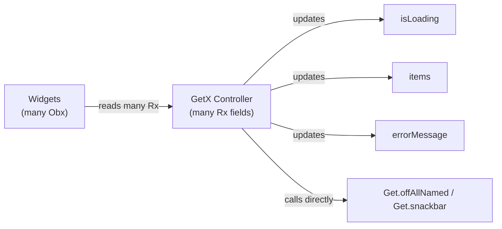
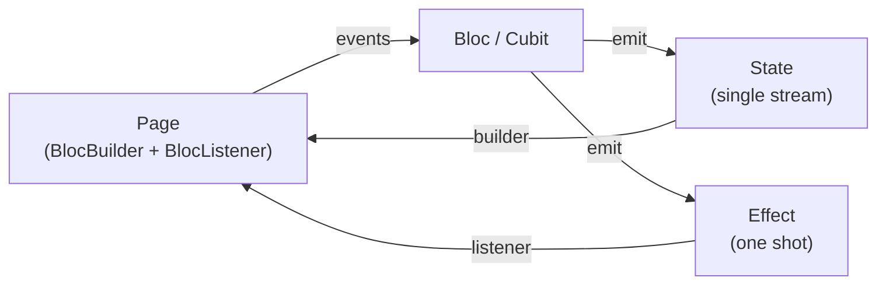
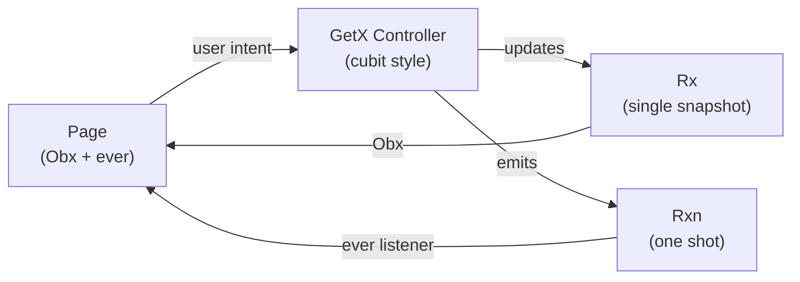
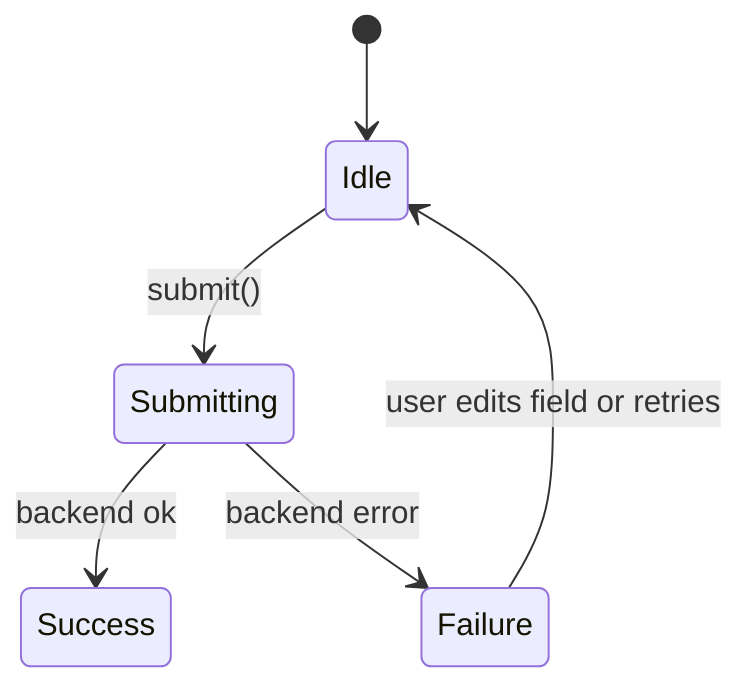

# GetX in Cubit Style for a Cooperative Finance App

## TL;DR

On an earlier project I abused GetX. I scattered many `Rx` fields per screen, triggered navigation
and snackbars directly from controllers, and let presentation logic leak everywhere. It worked, but
I kept hitting rebuild errors, subtle race conditions, and controllers that knew too much about the
UI.  
In my Orymu side project I used Bloc and Cubit more deliberately and I liked how it forced me into a
single state per screen and explicit transitions. On the next cooperative finance app I decided to
keep GetX for routing and dependency injection, but reshape the presentation layer around that
Cubit mental model: one state stream per screen, a separate effect channel for one shots, and clear
rules for when to use sealed state or composite form state.

---

## Context: where I started with GetX

KoperasiQu is a cooperative finance app for auth, balances, savings and loans, and transactions.
Before this project I had shipped a production app using GetX in a much less disciplined way.
Controllers were the place where everything went. I stored loading flags, errors, lists, filters,
pagination and even dialog state as separate `Rx` fields, and I also put navigation and snackbars
inside those controllers.

This trimmed version of a real controller from that period captures the pattern:

```dart
class AuthController extends GetxController {
  final LoginUseCase _loginUseCase;

  // ...

  final isLoading = false.obs;
  final isGoogleLoading = false.obs;
  final errorMessage = RxnString();

  final auth = Rxn<AuthEntity>();
  final token = RxnString();
  final userFullname = RxnString();
  final userUid = RxnString();
  final authRole = RxnString();

  Future<void> login({
    required String username,
    required String password,
  }) async {
    isLoading.value = true;
    errorMessage.value = null;

    try {
      final result = await _loginUseCase(
        username: username,
        method: 'password',
        password: password,
      );

      auth.value = result;
      token.value = result.authToken;
      userFullname.value = result.userFullname;
      userUid.value = result.userUid;
      authRole.value = result.authRole;

      Get.offAllNamed(HomeRoutes.main); // navigation from controller
    } on AuthException catch (e) {
      errorMessage.value = e.message;
    } catch (err) {
      errorMessage.value = err.toString();
    } finally {
      isLoading.value = false;
    }
  }
}
```

Some other controllers were worse. A single approval controller held more than ten `Rx` fields for
loading, pagination, filters, errors, history, and processing flags. At the same time my views
`Get.find` those controllers directly, called methods on them, manually popped `Navigator` levels,
and decided whether to show snackbars based on controller flags. The responsibilities were blurred.
It was hard to answer a simple question like, what state is this screen in right now.

In practice this shape showed up as UI rebuild errors and subtle race conditions. Loaders could be
stuck with old data, dialogs could close twice, and snackbars or navigation could trigger twice or
not at all, depending on rebuild timing.

I can represent that messy flow conceptually like this:



GetX itself was not the problem. My lack of structure was.

---

## Problem and constraints

Looking back at that code, a few concrete problems stand out.

- I had scattered observables. A typical screen kept `isLoading`, `items`, `errorMessage`,
  pagination flags and filter values in different `Rx` fields. The UI could easily show old data
  with a new loading flag or lose inline errors when loading.
- Controllers became god objects. They talked to use cases, held UI specific timers like `debounce`,
  reached into other controllers with `Get.find`, and called navigation and snackbars directly.
- There was no clear pattern for when to show loading, failure or success. Each screen invented its
  own combination of flags and `Obx` widgets.
- One shot actions were mixed into state. A retry could happen while the widget tree was rebuilding,
  which sometimes caused double navigation or duplicate snackbars.
- Dependency injection was hidden. `Get.find` inside methods made it harder to see which
  collaborators a controller really depended on and made tests more awkward.

On this project I did not want to repeat this. At the same time I had real constraints.

- We decided to keep GetX for routing and dependency injection.
- I could not stop the project and rewrite everything in one go, so any new pattern had to be
  adoptable screen by screen.

I needed a presentation architecture that gave me a single source of truth per screen and a
predictable way to handle one shot events, while still fitting into an existing GetX codebase.

---

## Aha moment: Bloc and Cubit in Orymu

The pattern that finally clicked for me came from a side project, Orymu. On that app I built a
library list screen with Bloc and Cubit. At first I was just impressed by how clean the UI looked
when deciding between states.

```dart
BlocBuilder<LibraryListBloc, LibraryListState>(
  builder: (context, state) {
    return switch (state.status) {
      LibraryListStatus.initial || LibraryListStatus.loading => _buildLoadingState(),
      LibraryListStatus.failure => _buildErrorState(
          state.errorMessage,
        ),
      LibraryListStatus.success when state.items.isEmpty =>
        const LibraryEmptyState(type: LibraryCardType.done),
      LibraryListStatus.success => _buildList(state),
      LibraryListStatus.loadingMore => _buildList(
          state,
          showFooterLoader: true,
        ),
    };
  },
)
```

One builder, one `status` enum, and all UI branches for loading, empty, failure, list and load more
in a single `switch`. There were no scattered `Rx` flags and no question about where the loading
state should be handled.

When I opened the Bloc itself, the mental model became even clearer.

```dart
class LibraryListBloc extends Bloc<LibraryListEvent, LibraryListState> {
  LibraryListBloc({required GetUserBooksUseCase getUserBooks})
      : _getUserBooks = getUserBooks,
        super(const LibraryListState()) {
    on<LibraryListStarted>(_onStarted);
    on<LibraryListNextPageRequested>(_onNextPageRequested);
    on<LibraryListFilterChanged>(_onFilterChanged);
    on<LibraryListRefreshed>(_onRefreshed);
    on<LibraryListIncludePrivateChanged>(_onIncludePrivateChanged);
    on<LibraryListGenreChanged>(_onGenreChanged);
    on<LibraryListSearchChanged>(_onSearchChanged);
    on<LibraryListDetailResultApplied>(_onDetailResultApplied);
  }

  final GetUserBooksUseCase _getUserBooks;

  Future<void> _onNextPageRequested(
    LibraryListNextPageRequested event,
    Emitter<LibraryListState> emit,
  ) async {
    if (!state.hasNextPage || state.isLoadingMore) return;

    final nextPage = state.page + 1;
    emit(state.copyWith(status: LibraryListStatus.loadingMore, page: nextPage));
    await _fetchPage(emit, page: nextPage, resetList: false);
  }

  Future<void> _fetchPage(
    Emitter<LibraryListState> emit, {
    required int page,
    required bool resetList,
  }) async {
    final result = await _getUserBooks(
      page: page,
      limit: state.limit,
      status: state.statusFilter,
      includePrivate: state.includePrivate,
      genre: state.genre,
      search: state.search,
      sort: state.sort,
    );

    result.fold(
      (failure) => emit(
        state.copyWith(
          status: LibraryListStatus.failure,
          errorMessage: failure.userMessage,
          page: resetList ? 1 : (state.page > 1 ? state.page - 1 : 1),
        ),
      ),
      (paginated) {
        final updatedItems =
            resetList ? paginated.items : [...state.items, ...paginated.items];
        emit(
          state.copyWith(
            status: LibraryListStatus.success,
            items: updatedItems,
            hasNextPage: paginated.hasNext,
            errorMessage: null,
          ),
        );
      },
    );
  }
}
```

Every user intent was an event, the Bloc held one `LibraryListState` that contained items, filters
and pagination, and there was a single `_fetchPage` that mapped use case results into a new state.
Even one shot effects, such as a toast after a book was removed, were modelled as an `effect` field
that I set and cleared explicitly.

Compared to my old GetX screens with many `Rx` flags and controller driven navigation, this felt
like there was finally one place where the truth lived. I liked how Cubit and Bloc forced me into
single state and explicit transitions and I wanted to bring that mental model back into a GetX
codebase.

I can summarise that cleaner flow like this.



---

## Decision: bringing a Cubit mental model into GetX

I decided to keep GetX for routing and dependency injection, but to treat each GetX controller more
like a Cubit. At first my rules were simple: one sealed state per screen for fetch flows, plus an
optional effect channel for one shot navigation and snackbars. I applied that same sealed pattern
everywhere, including forms, and only later realised that complex forms were a different beast.

Over time those rules evolved into something more concrete.

- Each screen should have one reactive state. For fetch and display screens this is usually a sealed
  state with variants like `Initial`, `Loading`, `Empty`, `Data`, `Failure`. For form heavy screens
  this later became a composite state that holds a form snapshot, a status enum and request error
  information.
- One optional effect channel per screen. Controllers expose `Rxn<Effect>` for navigation, dialogs
  and snackbars so that one shot actions do not leak into state and do not depend on rebuild timing.
- Controller methods represent user intents. They orchestrate use cases and map results into a new
  state or an effect. They do not call `Get.offAllNamed` or `Get.snackbar` directly.
- Constructor injection instead of hidden `Get.find`. Bindings are responsible for wiring
  collaborators so tests can construct controllers with fake dependencies.

I also wanted this to be a team pattern, not a personal habit. That is why I pulled the rules and
examples into our UI state architecture guide, including a decision matrix for when to use sealed
versus composite state, and a list of anti patterns to avoid.

At a high level the new flow for a screen looks like this.



---

## Solution overview

From these decisions the concrete shape of the presentation layer I use now looks like this. I first
applied it on this cooperative finance app and then carried the same pattern into newer projects:

- One reactive state per screen.
  - Sealed state for fetch and display flows, including pagination.
  - Composite state for form heavy flows like sign in, sign up, PIN and KYC.
- An optional effect channel per screen, backed by `Rxn<Effect>`, for navigation, dialogs and
  snackbars.
- Views that use a single `Obx` to render state and a single `ever` listener to react to effects.
- Controllers that use constructor injection for use cases and helper services and map their results
  into state and effects.

In the rest of this case study I will walk through two concrete examples that shaped the pattern,
and then show how I used effects to clean up navigation and snackbar races.

---

## Example: composite form for sign up

Sign up was my first test of a composite form pattern inside this new GetX style. I wanted a state
that could hold a full snapshot of the form, a status for the current request and any error coming
back from the server, so that inline validation and request failures would not fight each other.

This is the simplified shape of the state.

```dart
enum SignUpRequestStatus { idle, submitting, success, failure }

class SignUpFormView {
  final String? fullnameError;
  final String? phoneError;
  final String? passwordError;
  final String? confirmPasswordError;
  final String? formMessage;
  final String? coopError;
  final bool requireConfirmPassword;

  const SignUpFormView({
    this.fullnameError,
    this.phoneError,
    this.passwordError,
    this.confirmPasswordError,
    this.formMessage,
    this.coopError,
    this.requireConfirmPassword = true,
  });

  SignUpFormView copyWith({
    String? fullnameError,
    String? phoneError,
    String? passwordError,
    String? confirmPasswordError,
    String? formMessage,
    String? coopError,
    bool? requireConfirmPassword,
  }) {
    return SignUpFormView(
      fullnameError: fullnameError ?? this.fullnameError,
      phoneError: phoneError ?? this.phoneError,
      passwordError: passwordError ?? this.passwordError,
      confirmPasswordError: confirmPasswordError ?? this.confirmPasswordError,
      formMessage: formMessage ?? this.formMessage,
      coopError: coopError ?? this.coopError,
      requireConfirmPassword:
          requireConfirmPassword ?? this.requireConfirmPassword,
    );
  }
}

class SignUpState {
  final SignUpFormView form;
  final SignUpRequestStatus status;
  final String? requestError;
  final SignInDataEntity? data;

  const SignUpState({
    this.form = const SignUpFormView(),
    this.status = SignUpRequestStatus.idle,
    this.requestError,
    this.data,
  });

  SignUpState copyWith({
    SignUpFormView? form,
    SignUpRequestStatus? status,
    String? requestError,
    SignInDataEntity? data,
  }) {
    return SignUpState(
      form: form ?? this.form,
      status: status ?? this.status,
      requestError: requestError ?? this.requestError,
      data: data ?? this.data,
    );
  }
}
```

Before I reached this composite shape I tried to stick with the sealed pattern everywhere. My first
version of the sign up state was a sealed `SignUpState` with a `SignUpForm` variant that held all
field errors and `formMessage`, plus `SignUpLoading`, `SignUpSuccess` and `SignUpFailure`. It looked
neat in code, but it did not match how the screen actually behaves.

- In the real UI the form is always visible, even while loading or after a failure. In the sealed
  type the form only existed in the `SignUpForm` variant, so when the state moved to
  `SignUpLoading` or `SignUpFailure` I had to fall back to a `const SignUpForm()` just to keep the
  widget tree happy. The type was effectively saying that the form disappeared, but the UI never
  removed it.
- Banner messages were split across variants. Inline validation lived in `formMessage` on
  `SignUpForm`, while server errors lived in `SignUpFailure.message`. Both the controller and the
  view had to remember where to put and where to read the message from, which became noisy once I
  started adding more cases.
- Some natural combinations were awkward or impossible to express without inventing more variants.
  For example, keeping the previous validation banner visible while a request is loading, or showing
  field level errors and a server error banner at the same time, would have pushed me towards extra
  variants like `SignUpLoadingWithForm` or `SignUpFailureWithForm`. I could feel the state space
  starting to explode.

As a temporary band aid I added helpers like `viewForm`, `isLoading` and `uiMessage` so the page did
not have to pattern match on all the sealed variants, and I faked a default form when the state was
not `SignUpForm`. That worked, but it was a sign that the sealed model did not really match the way
I thought about the screen.

The controller exposes just one `Rx<SignUpState>` plus an optional effect stream for navigation. On
every field change it validates that field, updates the `form` snapshot via a copy, and clears any
previous `requestError`. On submit it sets `status` to `submitting`, calls the use case, then sets
`status`, `requestError` and `data` based on the result, and emits a `NavigateToHomeEffect` when it
is time to move on.

The view reads everything it needs from a single reactive state, through small helpers.

```dart
Obx(() {
  final s = controller.state.value;
  final form = s.form;

  final isLoading = s.status == SignUpRequestStatus.submitting;
  final uiMessage = s.requestError ?? form.formMessage;

  // build fields with inline errors from form
  // show loading button state from isLoading
  // show error banner from uiMessage
  // ...
})
```

This composite form pattern fixed some of the pain I had in the past. The form snapshot is always
present, there is no casting from sealed variants in the view, and inline errors stay visible during
loading and failure instead of being lost whenever the state changes.

Conceptually the sign up flow looks like a simple state machine.



The important part is that `form` lives inside all of these states, so the UI never has to
reconstruct it from scratch.

---

## Example: sealed fetch and pagination for EVA mutation

On previous projects my list and pagination screens looked a lot like the approval controller I
showed earlier. I had flags like `_isLoading`, `_hasMore`, `_isError`, `_isUnauthorized`,
`_isLoadingHistory` and `_historyHasMore` living next to the lists, and the view tried to interpret
combinations of those flags to decide whether to show a loader, an empty state, or an error.

In this app I decided to treat EVA mutation as my testbed for a sealed pagination pattern that
follows the same idea as the Orymu library list but in GetX.

The state is sealed, and the data variant keeps both items and pagination flags together.

```dart
sealed class EvaMutationState {
  const EvaMutationState();
}

class EvaMutationInitial extends EvaMutationState {
  const EvaMutationInitial();
}

class EvaMutationLoading extends EvaMutationState {
  const EvaMutationLoading();
}

class EvaMutationEmpty extends EvaMutationState {
  const EvaMutationEmpty();
}

class EvaMutationFailure extends EvaMutationState {
  final String message;

  const EvaMutationFailure(this.message);
}

class EvaMutationData extends EvaMutationState {
  final List<EvaMutationEntity> items;
  final int page;
  final bool canLoadMore;
  final bool isRefreshing;
  final bool isLoadingMore;

  const EvaMutationData({
    required this.items,
    required this.page,
    required this.canLoadMore,
    this.isRefreshing = false,
    this.isLoadingMore = false,
  });

  EvaMutationData copyWith({
    List<EvaMutationEntity>? items,
    int? page,
    bool? canLoadMore,
    bool? isRefreshing,
    bool? isLoadingMore,
  }) {
    return EvaMutationData(
      items: items ?? this.items,
      page: page ?? this.page,
      canLoadMore: canLoadMore ?? this.canLoadMore,
      isRefreshing: isRefreshing ?? this.isRefreshing,
      isLoadingMore: isLoadingMore ?? this.isLoadingMore,
    );
  }
}
```

The GetX controller holds a single `Rx<EvaMutationState>` and guards load, refresh and load more to
avoid double fetches.

```dart
class EvaMutationController extends GetxController {
  final GetEvaMutationsUseCase _getEvaMutations;

  EvaMutationController(this._getEvaMutations);

  final Rx<EvaMutationState> state = const EvaMutationInitial().obs;

  Future<void> loadFirstPage() async {
    state.value = const EvaMutationLoading();
    final res = await _getEvaMutations(page: 0, size: 10);
    res.fold(
      (f) => state.value = EvaMutationFailure(f.toUiMessage()),
      (page) {
        final items = page.items;
        if (items.isEmpty) {
          state.value = const EvaMutationEmpty();
        } else {
          state.value = EvaMutationData(
            items: items,
            page: page.currentPage,
            canLoadMore: page.hasNext,
          );
        }
      },
    );
  }

  Future<void> loadMore() async {
    final s = state.value;
    if (s is! EvaMutationData || !s.canLoadMore || s.isLoadingMore) return;

    state.value = s.copyWith(isLoadingMore: true);

    final nextPage = s.page + 1;
    final res = await _getEvaMutations(page: nextPage, size: 10);
    res.fold(
      (f) => state.value = s.copyWith(isLoadingMore: false),
      (page) {
        final newItems = [
          ...s.items,
          ...page.items,
        ];
        state.value = EvaMutationData(
          items: newItems,
          page: page.currentPage,
          canLoadMore: page.hasNext,
        );
      },
    );
  }
}
```

The view mirrors the Orymu BlocBuilder idea with a single `Obx` that switches on state.

```dart
Obx(() {
  final s = controller.state.value;
  switch (s) {
    case EvaMutationInitial():
      return const SizedBox.shrink();
    case EvaMutationLoading():
      return _buildLoading();
    case EvaMutationEmpty():
      return _buildEmpty();
    case EvaMutationFailure(:final message):
      return _buildError(message);
    case EvaMutationData(:final items, :final isLoadingMore):
      return _buildList(items, showFooterLoader: isLoadingMore);
  }
})
```

Now one snapshot holds both the items and all of the pagination flags. There is no need to
coordinate separate `RxList` and `RxBool` fields, and the transitions are predictable, such as
`Loading` to `Empty` or `Data`, and `Data` with `isLoadingMore` set to show a footer spinner.

---

## Effects: fixing navigation and snackbar races

In my earlier GetX code controllers called `Get.offAllNamed` and `Get.snackbar` directly. Combined
with many `Obx` widgets and dialogs that built their own reactive trees, this easily caused double
navigation or duplicate snackbars when a method was triggered from multiple places or when the
widget tree rebuilt in the middle of an action.

In this codebase I separated these one shot actions into a dedicated effect channel. Controllers
expose `Rxn<Effect>`, and pages subscribe once in `initState` using `ever`. The controller sets an
effect when something should happen exactly once and then clears it. The view owns the actual
navigation and snackbar calls.

The pattern looks like this.

```dart
sealed class AuthEffect {
  const AuthEffect();
}

class NavigateHomeEffect extends AuthEffect {
  const NavigateHomeEffect();
}

class ShowErrorSnackbarEffect extends AuthEffect {
  final String message;

  const ShowErrorSnackbarEffect(this.message);
}

class SignInController extends GetxController {
  final SignInUseCase _signIn;

  SignInController(this._signIn);

  final Rx<AuthState> state = const AuthInitial().obs;
  final Rxn<AuthEffect> effect = Rxn<AuthEffect>();

  Future<void> submit(String username, String password) async {
    state.value = const AuthLoading();
    final res = await _signIn(username: username, password: password);
    res.fold(
      (f) {
        state.value = AuthFailure(f.toUiMessage());
        effect.value = ShowErrorSnackbarEffect(f.toUiMessage());
      },
      (data) {
        state.value = AuthSuccess(data);
        effect.value = const NavigateHomeEffect();
      },
    );
  }
}
```

In the page I listen to effects once and handle them in the UI layer.

```dart
late final SignInController controller;
Worker? _effectWorker;

@override
void initState() {
  super.initState();
  controller = Get.find<SignInController>();
  _effectWorker = ever<AuthEffect?>(
    controller.effect,
    (e) {
      if (e == null) return;
      switch (e) {
        case NavigateHomeEffect():
          Get.offAllNamed(HomeRoutes.main);
        case ShowErrorSnackbarEffect(:final message):
          _showErrorSnackbar(message);
      }
      controller.effect.value = null; // consume once
    },
  );
}

@override
void dispose() {
  _effectWorker?.dispose();
  super.dispose();
}
```

This small change removed an entire class of bugs. Controllers no longer know about `Navigator` or
presentation details and one shot actions no longer depend on rebuild timing. The view remains the
single place that decides how to present navigation and messages.

---

## Impact

Adopting this Cubit style presentation architecture inside GetX changed how I think about screens.

- The UI became more predictable. Single state per screen eliminated races between separate `Rx`
  fields and made it easier to reason about what the user should see after each action.
- Views became simpler. Each page has one `Obx` that switches on state and a single effect listener,
  instead of many small `Obx` widgets bound to different flags.
- Navigation and snackbars became safer. Effects removed double or missing one shot actions that
  were previously caused by controller driven calls and rebuild races.
- Testing improved. Controllers now depend on injected use cases and services and expose one state
  stream, which is straightforward to assert on in unit tests.
- New features have a clear default. The decision matrix for sealed versus composite state and the
  examples for sign up and EVA mutation give the team a shared pattern to follow.

---

## What I learned

Working through this refactor taught me that GetX is not inherently messy or clean. The difference
comes from the discipline I apply around state and effects. Bringing a Cubit mental model into a
GetX codebase gave me a simple rule, one state and one optional effect per screen, and that rule
reduced a lot of accidental complexity.

I also learned that writing down the rules matters as much as the code. The technical guides and
case studies in this repo, including the UI state architecture and this story, help me and future
teammates avoid repeating the same anti patterns and instead reach for a small set of well
understood patterns when building new screens.

I did not start this work with a perfect three point rule in mind. I began with sealed state plus
effects everywhere, then discovered through the sign up and other form flows that complex forms
wanted a composite form, status and messages state instead. Only after that did the pattern
crystallise in my head as three pillars: sealed state for fetch and pagination, composite state for
form heavy screens, and a separate effect channel for one shot navigation and snackbars.
