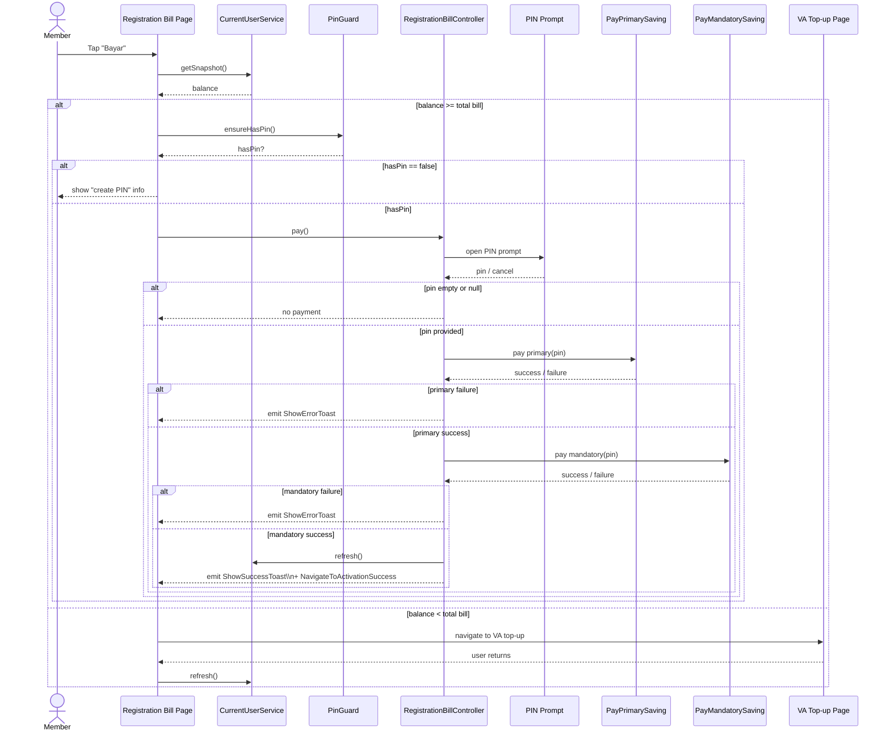

# KoperasiQu - Cooperative Savings & Payments

## Snapshot

- **Role:** Flutter Mobile Engineer (lead on cooperative member flows)
- **Timeframe:** 2025 - present
- **Stack:** Flutter (Dart), GetX, Dio, Firebase (Crashlytics/Messaging), secure storage, Fpdart
- **Platforms:** Android, iOS
- **Status:** In production, actively developed
- **Play Store:** https://play.google.com/store/apps/details?id=id.siesta.app.cooperativequ.jabar.bandungkab.mp

---

## TL;DR

In this project I worked as the primary Flutter engineer on the member side of a cooperative finance
app. Members sign in, activate their cooperative membership, see their savings wallet, pay primary
and mandatory savings, and pay via virtual accounts.  
Coming from a messier GetX codebase, I redesigned the presentation layer around a Cubit-style mental
model: one state stream per screen, an optional effect channel for one-shot navigation/snackbars,
and a clear rule for when to use sealed vs composite state. Underneath that, I modelled savings,
mandatory billing rules, and payment flows with clean domain/use case boundaries and
value-object-based validation. The result is a UI that behaves predictably and financial flows that
are easier to reason about and extend.

---

## Context

KoperasiQu is a cooperative finance app that lets members:

- Sign in or sign up and connect their account.
- Activate their cooperative membership and complete verification steps.
- See their primary and mandatory savings status in a wallet view.
- Open savings products, deposit and withdraw.
- Pay registration bills (primary + mandatory) or top up via virtual accounts.

Behind that experience there are several backend services for auth, cooperatives, savings and
payments. The mobile app has to coordinate status from those services in a way that feels coherent
to members: for example, the home screen should show different cards and actions depending on
whether primary savings have been paid, whether mandatory arrears exist, and whether the member has
opened savings products.

---

## My role

On this project I worked as the main Flutter engineer on the member app. I did not just build
screens, I helped shape how the app is structured and how cooperative flows are modelled.

On the feature side I owned or heavily contributed to:

- **Auth** - sign in and sign up flows, Google connect, auth check and splash, plus the effect-based
  navigation around them.
- **Membership and cooperative status** - member activation and verification flows, and how the home
  screen reacts when a member is not yet fully active.
- **Savings** - the savings wallet, user savings products, primary and mandatory savings, mutation
  views, and the flows for creating, depositing and withdrawing savings.
- **Payments** - the virtual account payment list and instructions, and the way Registration Bill
  and other flows reuse VA and PIN prompts.

On the architecture side I:

- Brought a **feature-first Clean Architecture** with clear domain/data/presentation boundaries,
  aligned with the project architecture guide in this repo.
- Designed and documented a **UI state architecture** for GetX controllers, based on a Cubit-style
  pattern (single state and optional effect per screen, sealed vs composite).
- Applied the existing **validation and value object architecture** consistently in auth and
  savings, so complex forms rely on domain VOs instead of ad-hoc checks in widgets.

---

## Problem and constraints

There were a few things that made this project more than just a set of CRUD screens.

- **Financial complexity**

  - Membership status depends on whether primary savings have been paid, and mandatory savings may
    accumulate based on cooperative cycles.
  - Members can open savings products, deposit or withdraw, and payments must be reflected
    correctly in the wallet and history.
  - Registration Bill flows combine primary and mandatory savings and may route to top up if the
    balance is insufficient.

- **Technical constraints**

  - The team was already using GetX for routing and dependency injection; we did not want to rip it
    out.
  - I had seen the downsides of unstructured GetX: scattered `Rx` flags, controller-driven
    navigation and snackbars, and rebuild races causing duplicate actions.
  - We needed predictable behaviour around money, so UI bugs like double taps triggering multiple
    payments were not acceptable.

- **UX constraints**
  - The app needs to communicate state clearly: "you have not paid primary yet", "this month's
    mandatory has these rules", "you need to top-up via VA before paying".
  - PIN prompts must be reusable and consistent across flows, without leaking feature-specific
    logic into the PIN module itself.

Within those constraints I needed an architecture that kept financial flows correct, UI behaviour
predictable, and features evolvable as more cooperatives and products are added.

---

## Solution overview

At a high level I approached this app as a set of vertical slices on top of a shared architecture:

- **Feature-first Clean Architecture**

  - Features such as `auth`, `member`, `saving`, `payment` and `cooperative` live under
    `lib/features/<feature>/` with `domain`, `data` and `presentation` folders.
  - Subfeatures (for example saving activation vs mutations) own their own controllers, states,
    effects, pages and bindings, while reusing feature-level domain entities and repositories.

- **Domain and data layers**

  - Use cases and repositories model cooperative concepts in domain terms:
    - Auth: sign in/up, Google connect, session and auth check.
    - Savings: user savings, saving products, primary and mandatory savings, deposit/withdraw
      flows.
    - Payments: fetching virtual account methods and instructions.
    - Cooperative: loading cooperative information that influences billing and visibility.
  - DTOs live in `data/model`, repositories adapt them into domain entities and failures, keeping
    the rest of the app DTO-free.

- **Presentation with GetX in Cubit style**

  - Each screen has a GetX controller that exposes one reactive state (sealed or composite) and an
    optional effect stream for one-shot navigation/snackbars.
  - Views use a single `Obx` to render based on state and a single `ever` listener to react to
    effects, instead of many small `Obx` widgets tied to separate flags.
  - I documented this pattern in a UI state architecture guide and a separate sub case study
    ([GetX in Cubit Style: Single State + Explicit Effects](/blog/getx-in-cubit-style-single-state-effects)).

- **Validation and value objects**

  - For auth and savings forms I reused the value object and validation architecture defined in the
    technical docs.
  - Controllers use VOs for real-time validation, and use cases perform final validation before
    calling repositories, which keeps controllers thin and domain rules centralized.

- **Payments and VA flows**
  - The payment module exposes a virtual account list and detailed instructions, and other flows
    (like Registration Bill) navigate into that module instead of duplicating VA logic.
  - A reusable PIN prompt module acts as a "prompt only" UI that returns a PIN; it does not contain
    business logic and can be reused in multiple savings and payment flows.

In the rest of this case study I focus on two challenges where these decisions mattered most:
structuring the presentation layer, and modelling savings and mandatory billing.

---

## Key challenge 1: presentation architecture and UI state

Before this project I had built a GetX app where controllers held many `Rx` fields (`isLoading`,
`items`, `errorMessage`, pagination flags, filter values) and also handled navigation and snackbars
directly. That shape led to rebuild races and logic that was hard to test or reason about. For this
cooperative app I wanted to keep GetX but avoid those traps.

I borrowed the mental model I liked from using Bloc and Cubit on my Orymu side project: a single
state per screen, explicit transitions, and a separate channel for one-shot effects. In this app
that turned into:

- **One state stream per screen**

  - Fetch and display screens use sealed states (`Initial`, `Loading`, `Empty`, `Data`, `Failure`)
    with pagination flags kept inside the `Data` variant.
  - Form heavy screens, such as sign up and savings flows, use a composite state with a persistent
    form snapshot, a request status enum and request error.

- **One optional effect channel per screen**

  - Controllers expose `Rxn<Effect>` for navigation, dialogs and snackbars.
  - Pages subscribe once using `ever`, perform UI actions (for example navigate to Home, show
    snackbar), and then clear the effect.

- **Thin controllers and testable flows**
  - Controller methods represent user intents: they call use cases, map results into state, and emit
    effects.
  - Bindings wire use cases and repositories into controllers via constructor injection, which makes
    unit tests straightforward.

This pattern is described in detail in my separate sub case study,
[GetX in Cubit Style: Single State + Explicit Effects](/blog/getx-in-cubit-style-single-state-effects).
Here, the important part is that it gave me a predictable foundation for the cooperative features:
screens have one source of truth, one place to emit one-shot events, and clear rules for when to use
sealed vs composite state.

---

## Key challenge 2: savings and mandatory billing flows

One of the more interesting parts of this app is how it handles savings and the Registration Bill,
which combines primary and mandatory savings in a way that respects cooperative rules.

### 2.1 Primary and mandatory savings

Members need to pay a primary saving and then ongoing mandatory savings. The Registration Bill flow:

- Reads the member's balance from a shared `CurrentUserService`.
- Computes the total bill (primary + mandatory) based on:
  - Cooperative configuration (for example a `cycleMonthStart` that defines when billing cycles
    start).
  - Data from the `/savings/user/mandatory` endpoint, which returns monthly amounts and a `skip`
    flag.
- Decides whether the member can pay directly or needs to top up via a virtual account.

On the domain side I modelled mandatory savings with entities and use cases:

- `MandatorySavingEntity` holds fields like `year`, `period` (month), `amount` and `skip`.
- `GetUserMandatorySavingsUseCase` fetches these entities for the current user.

The billing rules are encoded in a small helper that:

- Always includes the current month's amount if it exists.
- Walks back through previous months in the same year down to `cycleMonthStart`.
- Only includes months where `skip == false`.
- Treats missing months as zero.

This mirrors the logic described in the mandatory savings billing technical notes and gives a clear,
testable way to compute what "mandatory arrears" means for a given cooperative configuration.

### 2.2 PIN prompt and Registration Bill flow

Once the bill amount is known, the Registration Bill flow has to:

- Prompt the member for a PIN once.
- Pay primary savings.
- Only if primary succeeds, pay mandatory savings.
- Refresh status so the home screen can reflect the new state.

The high level flow looks like this.

I designed a reusable PIN prompt module as a "prompt only" UI:

- The PIN page accepts a `PinRequest` with title, subtitle and options (for example whether
  confirmation is required).
- It returns a 6-digit PIN to the caller via navigation, without containing any feature-specific
  logic.
- The Registration Bill controller is responsible for:
  - Navigating to the PIN prompt.
  - Using the returned PIN to call the primary and mandatory payment use cases in order.
  - Emitting effects for success and errors so the view can show banners or navigate back.

This keeps the PIN module thin and reusable, while the savings and payment features own their
business logic and error handling.

### 2.3 Impact on savings and billing UX

Putting the billing rules and flows into explicit domain entities, use cases and helper functions
made it much easier to:

- Explain to non-technical stakeholders how the Registration Bill is calculated and why certain
  months are included or skipped.
- Adjust behaviour (for example adding cross-year cycles later) without touching widgets.
- Keep the UI focused on rendering: the page receives a clear bill summary and uses the shared PIN
  prompt and VA screens, instead of re-implementing payment logic.

---

## Impact

This combination of architecture and feature work had a few concrete effects.

- **For members**

  - Savings and billing flows feel more predictable: primary and mandatory savings behave according
    to clear rules, and the app explains when a top up is needed.
  - Payment interactions are more consistent: PIN prompts and virtual account screens behave the
    same across flows.
  - The app is less likely to misbehave when forms, lists and dialogs update at the same time.

- **For the team**

  - New screens can reuse a clear pattern: a GetX controller with one state stream and optional
    effects, wired via bindings to use cases.
  - Savings and payment rules live in well-named use cases and helpers instead of being duplicated
    in controllers or widgets.
  - Technical guides (project architecture, UI state architecture, validation, savings/payment
    docs) make it easier to onboard new developers.

- **For the business**
  - Cooperative savings and mandatory billing are easier to reason about and change as rules
    evolve.
  - The same architecture can support additional cooperatives, products or payment flows without
    rebuilding the app from scratch.

---

## What I learned

Working on this cooperative app reinforced a few ideas for me.

- From an engineering perspective, I learned that I do not need to abandon a framework like GetX to
  get a disciplined architecture. Bringing in Cubit-style state and effect patterns, plus Clean
  Architecture boundaries, was enough to turn previous pain points into predictable flows.
- Modelling domain rules such as mandatory savings billing explicitly, and backing them with small
  technical notes and helpers, makes it much easier to keep financial logic correct and explainable.
- From a team perspective, documenting patterns in plain language and examples - for UI state,
  validation and savings/payment flows - matters as much as the patterns themselves. It turns
  individual preferences into a shared architecture that other engineers can rely on and extend.

{/* Image Gallery is rendered by WorkGallery component based on filesystem/frontmatter. */}
