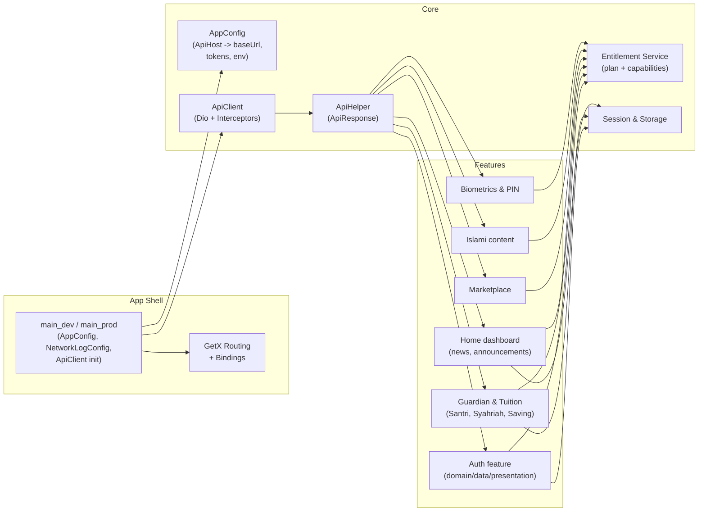

# PesantrenQu — Parent–School Super App Case Study

A Flutter “super app” that connects parents to their children’s Islamic boarding schools for
tuition, savings, donations, and daily updates — all in one place.

---

## Snapshot

- **Role:** Flutter Mobile Engineer (lead on this app)
- **Company / Client:** PT SIESTA – PesantrenQu / parent–school platform
- **Timeframe:** 2025 – present
- **Stack:** Flutter (Dart), GetX, Dio, Firebase (Crashlytics, Messaging), Secure Storage, Freezed,
  Fpdart
- **Platforms:** Android, iOS
- **Status:** In production, actively developed

---

## Product in one paragraph

This project is a mobile “super app” for parents of boarding‑school students. Parents can sign in,
link their account to one or more schools, see their children’s balances and bills, pay
tuition (syahriah) and installments, top up and transfer savings, make donations, and
consume school‑curated Islamic content. Schools can offer different plan tiers
(Basic/Gold/Platinum), which unlock more advanced features such as financial overviews, reporting,
and security options like biometric login and PIN management.

---

## Context & problem

Many schools still manage parent communication and payments across disconnected channels:

- Tuition and fees are handled manually (spreadsheets, bank transfers, WhatsApp confirmations).
- Parents lack a single place to see balances, recent transactions, or their children’s status.
- New features (like digital donations or advanced reporting) are hard to roll out consistently.
- Different schools need different feature sets depending on their budget and maturity.

When I joined the project, the goal was to give parents **one consistent mobile experience** across
schools while still letting each school decide how advanced they wanted to be. In practice, that
meant:

- Offering a mix of core features (auth, balances, tuition, donations, profile, Islamic content).
- Letting schools enable advanced features based on their subscription plan.
- Hiding complexity behind a single mobile client that talks to multiple backend services (`core`,
  `account`, `guardian`, `geolocation`, `billing`, `saving`, `reports`, etc.).

---

## My role & responsibilities

On this project I worked as the main mobile engineer and de‑facto technical lead for the Flutter
app. I didn’t just build screens, but also helped shape how the app is structured, how it talks to
the backend, and how we keep things maintainable as new schools and features come in.

On the architecture side, I pushed for a **feature‑first Clean Architecture** layout with clear
domain/data/presentation boundaries and GetX bindings for dependency wiring. I also wrote most of
the technical guides under `docs/technical/` (project architecture, domain/data, validation, UI
state) so that other developers could plug into the same patterns instead of inventing their own per
feature.

I designed and implemented several **core services** that the rest of the app depends on: a typed
networking layer (`ApiClient` + interceptors + `ApiHelper`), the current user/session services, and
an environment‑driven configuration system (`AppConfig`, `Env`, `ApiHost`) that reads from
`dart-define` files. This gave us a single way to target many backend hosts while keeping logging
and network behavior configurable per environment.

One of the most important pieces for me was the **plan and entitlements system**. Instead of sprinkling
`if (plan == "gold")` checks across the UI, I introduced a capability‑based
`IFeatureEntitlementService`. Plans (Basic/Gold/Platinum) map to capabilities like
`guardian.financial_overview` or `security.manage_pin`, and controllers or route guards ask for
capabilities, not raw plan names. This made it much easier to roll out new plans or move features
between tiers.

I also owned the **biometric and security flows**. I built end‑to‑end biometric enrollment and
unregistration using hardware‑backed keys and canonical JSON signatures, plus a device–account
binding model that uses secure storage (phone, device ID, key fingerprint). On top of that, I took
responsibility for the core parent/guardian financial flows: syahriah (tuition) overview,
installments, payment history, guardian savings, and donation flows, making sure those features
reused the shared services (networking, entitlements, session) instead of re‑implementing their own
logic.

---

## How we solved it (solution overview)

### Feature‑first Clean Architecture

From the beginning I treated this as a feature‑first Clean Architecture app. Instead of a flat
`screens/` folder, each domain area lives under `lib/features/<feature>` with its own `domain`,
`data`, and `presentation` layer:

- `lib/core/` handles cross‑cutting concerns:
    - Networking (`ApiClient`, interceptors, `ApiHelper`, connectivity).
    - Config (`AppConfig`, `Env`, `ApiHost`).
    - Storage (preferences, secure storage, session manager).
    - Entitlements, analytics, device info, shared widgets, geolocation.
- `lib/features/` is grouped by domain (auth, guardian, home, donation, tuition/syahriah, islami,
  profile, biometric, pin, verification, geolocation):
    - Each feature has `domain/` (entities, repositories, use cases),
      `data/` (datasources, models, repository implementations),
      `presentation/` (bindings, controllers, states/effects, pages, widgets).
- GetX bindings wire routes to their controllers and dependencies so widget trees stay focused on
  UI, not construction logic.

This structure keeps business rules in **use cases** and repositories, and keeps presentation thin
and reactive. When we added new slices (for example, guardian saving, donation, or Islamic content),
we could follow the same pattern without debating architecture every time.

### Main user flows

At a high level, I designed the client around a few core flows:

- **Authentication & onboarding**
    - Phone‑based sign‑in with OTP and password, wired into domain use cases and auth repositories.
    - Optional biometric sign‑in once enrollment is complete.
    - Account checks and school selection flows so one phone can represent multiple
      guardians/schools.
- **Parent home & student overview**
    - A home dashboard with parent cards, “santri” cards (student status), balances, and quick
      actions.
    - Announcements, news, and notifications feeds backed by typed repositories and paged states.
- **Child activity & academic tracking**
    - Student‑centric views under the guardian “santri” feature (profile, recitation, achievements,
      activities, attendance, health, permissions, reports).
- **Tuition & financial flows**
    - Syahriah (tuition) overview, regular and installment plans, payment history, and bill
      details.
    - Student financial overview (balances, bills, installment summaries, transaction history).
    - Guardian savings and in‑house transfers between accounts and school products.
    - Donations and ZISWAF flows integrated with the backend donation services.
- **Content & communication**
    - Islamic content (prayer times using geolocation, tausiah, “ask ustadz” widgets, and other
      curated content).
- **Profile, security & entitlements**
    - Profile management and account security (PIN, password, biometric settings).
    - Plan‑aware UI: certain features are only visible or enabled when the current school plan
      includes the matching capability.

### High‑level architecture (runtime view)

---

## Key challenges & deep dives

Below are some of the challenges that were important enough for me to turn into separate case
studies.

1. **Plan‑based features without `if (plan == "gold")` everywhere**  
   I needed a way for schools on different subscription plans (Basic/Gold/Platinum) to unlock or
   hide features without scattering plan checks across the codebase. The solution was a
   capability‑based entitlement system that:
    - Maps each plan to a set of capabilities (`security.manage_pin`, `guardian.financial_overview`,
      etc.).
    - Exposes a single `IFeatureEntitlementService` with `hasCapability(...)` and a reactive stream.
    - Integrates into controllers and route guards to gate premium routes and menu items.  
      → See: **[Capability‑Based Entitlement System](/blog/capability-based-entitlement-system)**

2. **Secure biometric enrollment & verification**  
   Optional biometric login sounds simple, but doing it securely (and per device/account) required a
   proper design:
    - Hardware‑backed keypair creation via the platform keystore; private keys never leave the OS.
    - A challenge–response protocol using canonical JSON payloads and signatures passed via
      `X-AUTH-SIGN`.
    - A secure enrollment store that binds phone + device ID + public key fingerprint to avoid
      silent cross‑account reuse.
    - Friendly handling of “no hardware”, “not enrolled”, “locked out”, and permission issues in the
      UI.  
      → See: **[Biometric Enrollment & Verification](/blog/biometric-enrollment-verification-case-study)**

---

## Impact / results

Even without public metrics, from an engineering perspective this work
changed a few things:

- **For guardians and parents**
    - They have a single app to view multiple children across multiple schools.
    - They can see balances, upcoming bills, and payment history in one place instead of juggling
      manual transfers and WhatsApp confirmations.
    - They can pay tuition and installments, manage guardian savings, and donate from the same app.

- **For schools**
    - They can launch with a **Basic** feature set and later unlock **Gold/Platinum** capabilities
      without changing client code.
    - They get a consistent client‑side integration to multiple backend services, which makes
      onboarding new schools or enabling new modules much easier.

- **For the engineering team**
    - We reuse the same networking and entitlement infrastructure across features, which reduces
      duplication and bugs.
    - We have clearer logs and a CLI probe for debugging tricky API issues together with the backend
      team.

---

## What I learned

Some personal takeaways from working on this project:

- I learned how to scale a **feature‑first Clean Architecture** in a real, multi‑module Flutter app
  without slowing the team down.
- I saw how important it is to keep **cross‑cutting concerns** (networking, entitlements,
  biometrics) reusable but not over‑engineered.
- I became more deliberate about API design (both client and server) so that:
    - Security‑sensitive features like biometric auth stay verifiable and easy to reason about.
    - Plan‑based access can evolve without destabilizing the rest of the app.
- I also saw how much developer experience improves when you invest early in **tooling** (CLI
  probes, logging modes, documentation) and keep them part of the normal workflow.

---

## Links & visuals

- **Play Store:** https://play.google.com/store/apps/details?id=id.siesta.app.pesantrenqu.v2
- **Key screenshots:** Home dashboard, tuition/syahriah flow, donation, biometric enrollment.

{/* Image Gallery is rendered by WorkGallery component based on filesystem/frontmatter. */}
